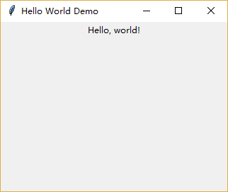

### 先来个Hello World吧

本节的主要内容是创建一个tkinter的窗口，在窗口上显示一行文字"Hello, world!", 并且设置一下窗口的大小。

而本节的重点是介绍实现上述内容的两种风格，一种是将代码放入函数中执行，另一种是在对象中执行。

-------------------------------------

1. 将代码放入函数中执行

    这是一种较为简单的书写风格，将所有的GUI代码封装到一个函数中，执行函数即可创建窗口。

        import tkinter as tk
        
        def main():
            # 这是一个窗口(window)，习惯上把它命名为root(有的也叫master)，可以容纳任何控件(widget)
            root = tk.Tk()
            # 设置主窗口的标题
            root.title("Hello World Demo")
            # 设置主窗口的大小为320x240。以屏幕左上角为原点设定一个二维坐标系(x轴水平方向，y轴竖直方向)，在(800,420)这个点显示窗口
            root.geometry("320x240+800+420")
        
            # 声明一个Label控件(widget)
            hello_world_label = tk.Label(root, text="Hello, world!")
            # 将Label控件pack到父控件(其实就是root)中
            hello_world_label.pack()
        
            # 这通常是tkinter程序需要执行的最后一句代码，执行后进入主事件循环
            tk.mainloop()
            
        if __name__ == '__main__':
            main()

    

2. 将代码封装到类中执行

    当创建较为复杂的应用时，将GUI代码封装到类中执行可能更加合理。

        import tkinter as tk
    
        class App(object):
            def __init__(self):
                # 这是一个窗口(window)，习惯上把它命名为root(有的也叫master)，可以容纳任何控件(widget)
                self.root = tk.Tk()
                # 设置主窗口的标题
                self.root.title("Hello World Demo")
                # 设置主窗口的大小为320x240。以屏幕左上角为原点设定一个二维坐标系(x轴水平方向，y轴竖直方向)，在(800,420)这个点显示窗口
                self.root.geometry("320x240+800+420")
        
                # 声明一个Label控件(widget)
                hello_world_label = tk.Label(self.root, text="Hello, world!")
                # 将Label控件pack到父控件(其实就是root)中
                hello_world_label.pack()
        
                # 这通常是tkinter程序需要执行的最后一句代码，执行后进入主事件循环
                tk.mainloop()
        
        if __name__ == '__main__':
            app = App()
            
    
