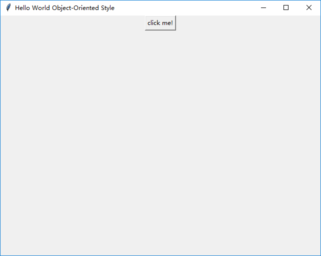

### 先来个Hello World吧

这是一种风格

    import tkinter as tk
    
    
    def main():
        root = tk.Tk()
        root.title("The Hello World Example")
        root.geometry("640x480+0+0")
        hello_world_label = tk.Label(root, text="Hello, world!")
        hello_world_label.pack()

        tk.mainloop()
    
    
    if __name__ == '__main__':
        main()

另一种风格：

    
    import tkinter as tk
    
    
    class App(object):
        def __init__(self):
            self.root = tk.Tk()
            self.root.title("Hello World Object-Oriented Style")
            self.root.geometry("640x480+0+0")
            self.btn = tk.Button(self.root, text="click me!", command=self.btn_callback)
            self.btn.pack()
            self.root.mainloop()
    
        def btn_callback(self):
            print("Hello world!")
    
    
    if __name__ == '__main__':
        App()

### Import 也是有风格的，你可以自己选用

* 比如直接导入到当前命名空间

        from tkinter import *
    
* 还有这种我比较喜欢的
        
        import tkinter as tk
        
* 还有特麻烦没见过别人用的

        import tkinter

### pack的不同风格

* 这种用于日后引用的

        btn = tk.Button(root, text="click me!")
        btn.pack()
        
* 这种一次性的
        
        tk.Button(root, text="click me!").pack()
