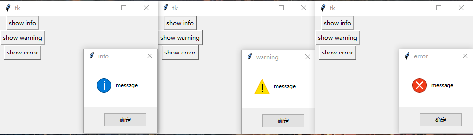

### MessageBoxes

------------------------------

1. `showinfo`， `showwarning`和`showerror`

    `tkinter.messagebox`共有3个`showxxx`的函数:

        tk.Button(root, text="show info", command=lambda: messagebox.showinfo(title="info", message="message")).grid()
        tk.Button(root, text="show warning", command=lambda: messagebox.showwarning(title="warning", message="message")).grid()
        tk.Button(root, text="show error", command=lambda: messagebox.showerror(title="error", message="message")).grid()
    
    