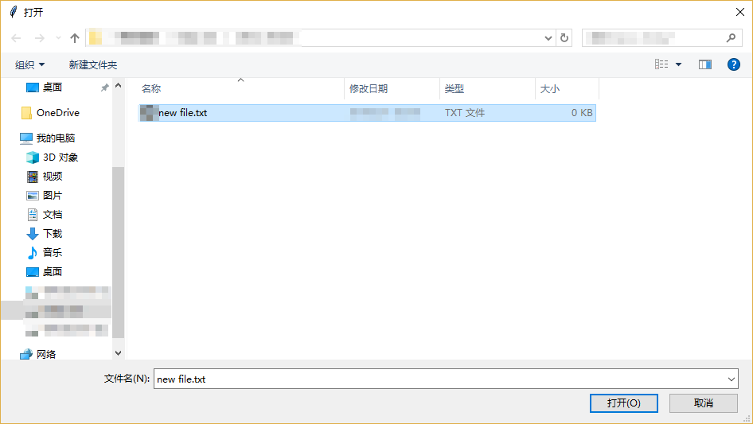
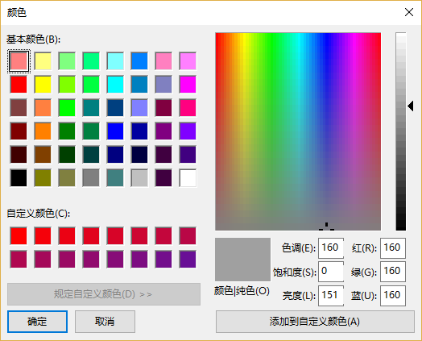

### 一些用于特定情况的弹出窗口

-----------------------------
1. filedialog

    `filedialog`通过弹出窗口，为用户提供文件操作。
    
    * 函数`askopenfilename()`，`askopenfilenames()`可以询问用户要打开的文件名，函数名中多出的`s`表明可以多选。
    
    * 函数`askdirectory()`可以得到用户选择文件夹名称
    
    * 函数`asksaveasfilename()`可以询问用户要存储文件的文件名
    
    * `askopenfile()`，`askopenfiles()`和`asksaveasfile()`同添加了`name/names`后缀的函数作用相同，
    但不同的是返回的不是字符串，而是文件句柄。
    
    下例示范`askopenfilename()`的使用。
    
        from tkinter import filedialog
        def callback():
            filename = filedialog.askopenfilename()
            print(filename)
        tk.Button(root, text="button", command=callback).pack()

    
    
2. colorchooser

    使用`colorchooser`的`askcolor()`方法询问用户颜色

    from tkinter import colorchooser
    def callback():
        filename = colorchooser.askcolor()
        print(filename)
    tk.Button(root, text="button", command=callback).pack()

    
