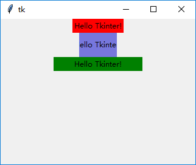
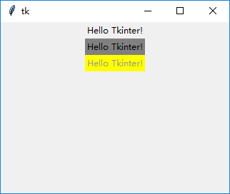
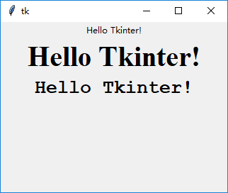

### 标签(Label)

`tk.Label`的作用主要是显示一行文字。

---------------------------
1. 使用`height`和`width`属性控制`tk.Label`的宽度和高度

    设置了背景色方便对比。
    
    第一个`Label`没有设置宽度和高度，那么这个控件的“默认空间使用策略”是占用尽量小的空间，但是要将其中的文字完全显示出来。
    
    第二个`Label`设置了宽度和高度，但是因为设定的宽度比较小，所以内部文字就没有显示完全。
    
    第三个`Label`也设置了宽度和高度。因为设定的宽度比较大，所以会留出一些空白区域。

        tk.Label(root, text="Hello Tkinter!", bg="red").pack()
        tk.Label(root, text="Hello Tkinter!", width=8, height=2, bg="#7777dd").pack()
        tk.Label(root, text="Hello Tkinter!", width=20, height=1, bg="green").pack()
        
    
    
2. 使用`bg`和`fg`属性设置`Label`的前景色和背景色:

    设置颜色，可以使用英文名称，比如`yellow`，`gray`。
    
    对于任意颜色，可以使用十六进制字符串表示，比如`#ffffff`。
    
        tk.Label(root, text="Hello Tkinter!").pack()
        tk.Label(root, text="Hello Tkinter!", bg="gray").pack()
        tk.Label(root, text="Hello Tkinter!", fg="#999989", bg="yellow").pack()

    
    
3. 使用`font`属性设置显示字体大小和样式:
    
    一种简便的表示方法是使用一个含有三个元素的`tuple`表示字体样式：(`{font-family}`, `{font-size}`, `{font-weight}`)
    
    而另一种是创建`tk.font.Font`对象，在初始化时传入关键字参数。
    
        from tkinter.font import Font
        from tkinter import font
        tk.Label(root, text="Hello Tkinter!").pack()
        tk.Label(root, text="Hello Tkinter!", font=Font(family="times", size=30, weight=font.BOLD)).pack()
        tk.Label(root, text="Hello Tkinter!", font=("Courier", 20, "bold")).pack()
    
    
