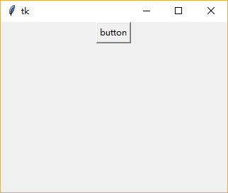
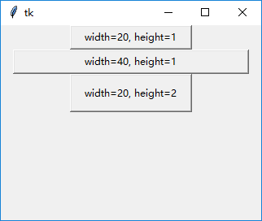
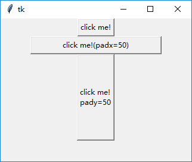
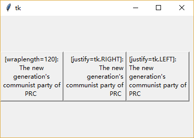
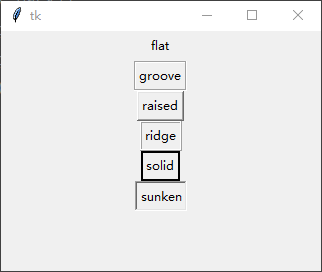

### 按钮(Button)

按钮和`Label`虽然都可以显示文字，但是按钮多了一个功能。

当用户按下按钮时，`tkinter`会执行按钮中`command`属性所指向的函数。

-------------------------------------------------
1. 使用`command`属性绑定回调函数

    这是按钮最常用，也是最重要的功能。
    
    定义一个函数，然后将`command`属性设置为这个函数，用户一点击按钮这个函数就会被执行。
    
        def callback():
            print("Button clicked")
        tk.Button(root, text="button", command=callback).pack()
        
    

2. 使用`width`和`height`属性指定按钮大小
    
    指定按钮的宽(按像素计)和高(按行数)。
    
        tk.Button(root, text="width=20, height=1", width=20, height=1).pack()
        tk.Button(root, text="width=40, height=1", width=40, height=1).pack()
        tk.Button(root, text="width=20, height=2", width=20, height=2).pack()
        
      

3. 使用`padx`和`pady`属性指定按钮内边距
    
    如果在按钮的声明中没有指定按钮的大小，那么按钮就会把里面的内容包住。这个时候添加适当的内边距可能更加美观。
    
        tk.Button(root, text="click me!").pack()
        tk.Button(root, text="click me!(padx=50)", padx=50).pack()
        tk.Button(root, text="click me!\npady=50", pady=50).pack()
    
    

4. 使用`wraplength`和`justify`属性控制多行显示时的样式
    
    可以使用换行符`\n`使得按钮可以显示多行文字(其实`tk.Label`也可以如此设置，将本例中的`Button`换成`Label`即可)。
    
    此时使用`wraplength`指定每行最大宽度，而`justify`指定文本对齐方式：
    
        root.geometry("380x240+800+420") # 本例如果使用默认320x240大小演示会有些窄，因此将窗口调宽一些
        s = "The new generation's communist party of PRC "
        tk.Button(root, text="[wraplength=120]:\n" + s, wraplength=120).pack(side=tk.LEFT)
        tk.Button(root, text="[justify=tk.RIGHT]:\n" + s, wraplength=120, justify=tk.RIGHT).pack(side=tk.LEFT)
        tk.Button(root, text="[justify=tk.LEFT]:\n" + s, wraplength=120, justify=tk.LEFT).pack(side=tk.LEFT)

    

5. 使用`relief`属性设置按钮样式
    
    注意第一个按钮。是不是和`tk.Label`看起来一模一样呢？
        
        tk.Button(root, text="flat", relief="flat").pack()
        tk.Button(root, text="groove", relief="groove").pack()
        tk.Button(root, text="raised", relief="raised").pack()
        tk.Button(root, text="ridge", relief="ridge").pack()
        tk.Button(root, text="solid", relief="solid").pack()
        tk.Button(root, text="sunken", relief="sunken").pack()
        
    
