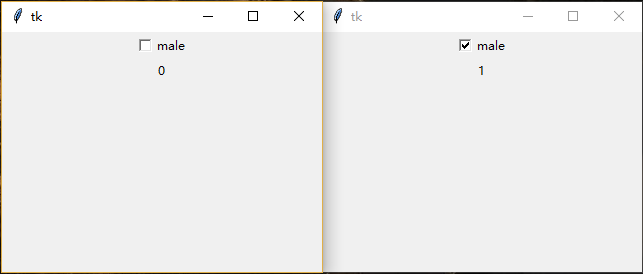
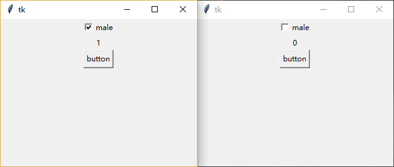

### 复选按钮(Checkbutton)

---------------------------
### 属性示例:

1. 使用`variable`属性判断用户是否勾选复选框

    使用`tk.Checkbutton`组件时，通常需要声明一个变量(比如`v = tk.Intvar()`)来追踪或者改变其状态。
    
    可通过其绑定的值来判断用户是否勾选。默认未选中是0，选中是1。
        
        # 声明变量
        v = tk.IntVar()
        # 复选按钮
        tk.Checkbutton(root, text="male", variable=v).pack()
        # 用于显示当前变量值的的Label
        tk.Label(root, textvariable=v).pack()

    
    
2. 使用`variable`属性

    只需改变`Checkbutton`绑定变量的值即可调整其勾选状态。
    
        # 声明变量
        v = tk.IntVar(value=1)
        # 复选按钮
        tk.Checkbutton(root, text="male", variable=v).pack()
        # 用于显示当前变量值的的Label
        tk.Label(root, textvariable=v).pack()
        # 用户点击按钮改变变量的值，从而改变复选按钮勾选状态
        tk.Button(root, text="button", command=lambda: v.set(1 - v.get())).pack()

    