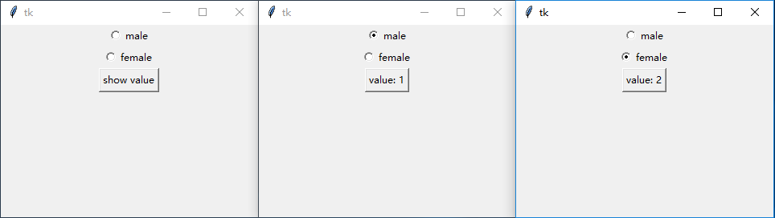

### 单选按钮(Radiobutton)

单选按钮和复选按钮(Checkbutton)非常相像。

不同的是，同组的单选按钮必须绑定同一个变量才能正常工作（比如"男"，"女"），否则效果和复选按钮没有什么区别。

-------------

### 声明：

    rbtn = tk.Radiobutton(root, text="male", variable=v, value=0)
    
    
### 可用属性：
    
    class Radiobutton(Widget):
        """Radiobutton widget which shows only one of several buttons in on-state."""
        def __init__(self, master=None, cnf={}, **kw):
            """Construct a radiobutton widget with the parent MASTER.
    
            Valid resource names: activebackground, activeforeground, anchor,
            background, bd, bg, bitmap, borderwidth, command, cursor,
            disabledforeground, fg, font, foreground, height,
            highlightbackground, highlightcolor, highlightthickness, image,
            indicatoron, justify, padx, pady, relief, selectcolor, selectimage,
            state, takefocus, text, textvariable, underline, value, variable,
            width, wraplength."""
            Widget.__init__(self, master, 'radiobutton', cnf, kw)
        def deselect(self):
            """Put the button in off-state."""
    
            self.tk.call(self._w, 'deselect')
        def flash(self):
            """Flash the button."""
            self.tk.call(self._w, 'flash')
        def invoke(self):
            """Toggle the button and invoke a command if given as resource."""
            return self.tk.call(self._w, 'invoke')
        def select(self):
            """Put the button in on-state."""
            self.tk.call(self._w, 'select')
            
### 属性示例：
1. `text`, `variable`和`value`
    
    使用`text`属性在单选按钮后侧显示文字。
    
    使用`variable`属性决定单选按钮的组。绑定同一个变量为一组。
    
    使用`value`属性决定用户选择单选按钮后，绑定变量的值
    
        # 声明要被绑定的变量
        v = tk.IntVar(value=0)
        # 两个单选按钮，因为variable都被设为v，所以属于同一组
        tk.Radiobutton(root, text="male", variable=v, value=1).pack()
        tk.Radiobutton(root, text="female", variable=v, value=2).pack()
        # 为了方便查看效果，添加了一个按钮查看变量的值
        def _btn_callback():
            btn['text'] = "value: {}".format(v.get())
        btn = tk.Button(root, text="show value", command=_btn_callback)
        btn.pack()
        
    
        
    