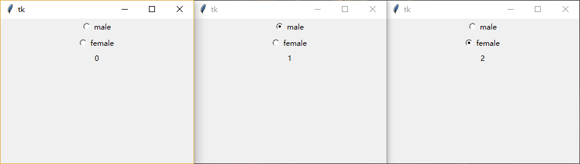

### 单选按钮(Radiobutton)

单选按钮和复选按钮(Checkbutton)非常相像。

与每一个复选按钮绑定一个变量不同的是，多个单选按钮通常绑定同一个变量以便于实现“单选”效果

-------------
1.  使用`variable`和`value`属性实现单选效果
    
    将`variable`属性绑定同一个变量，而`value`属性则设为不同值(比如0, 1...)
    
        # 声明变量
        v = tk.IntVar(value=0)
        # 两个单选按钮，因为variable都被设为v，而value属性设置成不同值，所以呈现“单选”效果
        tk.Radiobutton(root, text="male", variable=v, value=1).pack()
        tk.Radiobutton(root, text="female", variable=v, value=2).pack()
        # 查看变量值
        tk.Label(textvariable=v).pack()
        
    
