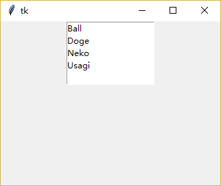
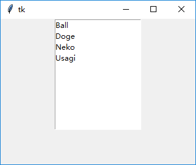
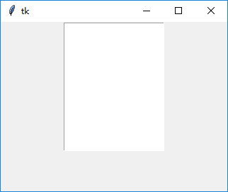
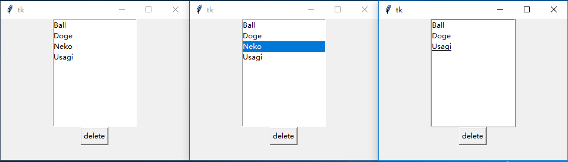
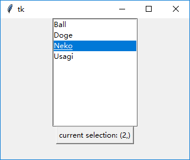
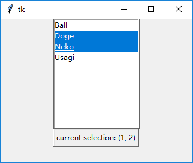

### 列表框(Listbox)

相对于单选按钮/复选按钮，列表框可以容纳更多的选项。

-----------------------------
1. 设置`width`和`height`属性调节大小

    设置`width`(按字符计)和`height`(按行计)属性，直接调整大小。
    
    此外，`Listbox`可以和`Scrollbar`(滚动条)共同使用以显示更多项，详见第四章Scrollbar一节。
        
        listbox = tk.Listbox(root, width=18, height=5)
        listbox.pack()
        listbox.insert(tk.END, "Ball")
        listbox.insert(tk.END, "Doge")
        listbox.insert(tk.END, "Neko")
        listbox.insert(tk.END, "Usagi")
        
    

2. 使用`insert()`方法插入

    一般使用`tk.END`在列表末尾插入项
        
        listbox = tk.Listbox(root)
        listbox.pack()
        listbox.insert(tk.END, "Ball")
        listbox.insert(tk.END, "Doge")
        listbox.insert(tk.END, "Neko")
        listbox.insert(tk.END, "Usagi")
        
    
    
    
3. 使用`delete()`方法删除
    
    可以对函数`delete(self, first, last=None)`传入`first`和`last`，
    从而删除所有从`first`到`last`的项(包括`last`)：
    
        listbox.insert(tk.END, "Ball")
        listbox.insert(tk.END, "Doge")
        listbox.insert(tk.END, "Neko")
        listbox.insert(tk.END, "Usagi")
        listbox.delete(0, tk.END)
    
    
    
    也可以省略`last`参数，从而删除特定项。可以使用`tk.ANCHOR`实现点击按钮删除所选项：
    
        listbox.insert(tk.END, "Ball")
        listbox.insert(tk.END, "Doge")
        listbox.insert(tk.END, "Neko")
        listbox.insert(tk.END, "Usagi")
        tk.Button(root, text="delete", command=lambda *args: listbox.delete(tk.ANCHOR)).pack()
        
    
    
4. 使用`curselection()`方法获得当前用户选择项的列表
    
    返回的列表是一个`int`类型组成的`tuple`，从零开始计数
    
        listbox.insert(tk.END, "Ball")
        listbox.insert(tk.END, "Doge")
        listbox.insert(tk.END, "Neko")
        listbox.insert(tk.END, "Usagi")
        def btn_callback():
            btn['text'] = "current selection: " + str(listbox.curselection())
        btn = tk.Button(root, text="show selection", command=btn_callback)
        btn.pack()
    
    

5. 设置`selectmode`属性控制用户选择模式

    从单选到多选依次为：
    
    `tk.SINGLE`     ：单选，只能通过鼠标单击改变选定项
    
    `tk.BROWSE`     ：单选，除通过鼠标单击改变选定项外，还能通过鼠标拖动改变选定项
    
    `tk.MULTIPLE`   ：多选，只能通过鼠标单击改变选定项
    
    `tk.EXTENDED`   ：多选，除通过鼠标单击改变选定项外，还能响应鼠标拖动、`Ctrl`和`Shift`
    
        listbox = tk.Listbox(root, selectmode=tk.EXTENDED)
        listbox.pack()
        listbox.insert(tk.END, "Ball")
        listbox.insert(tk.END, "Doge")
        listbox.insert(tk.END, "Neko")
        listbox.insert(tk.END, "Usagi")
    
    
    