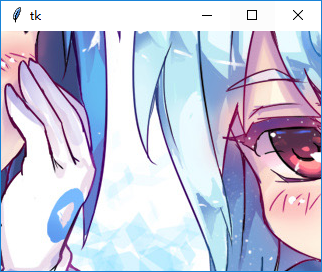
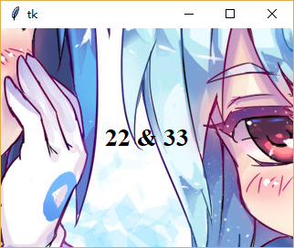
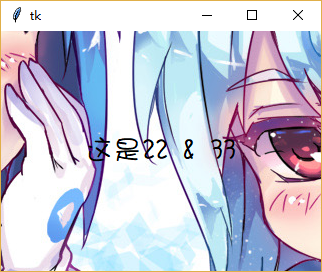

### PhotoImage

--------------------------------------

1. 显示图片

    由于`tk.PhotoImage`类支持的图片种类不多，故在此不做介绍。
    笔者在此介绍使用`PIL.ImageTk.PhotoImage`类结合`tk.Label`显示图片的方法。
    
    只要设置`tk.Label`的`image`属性为创建的`PIL.ImageTk.PhotoImage`对象即可。
    
    注意！如果不对创建的`PIL.ImageTk.PhotoImage`的对象进行引用，那么就会被垃圾回收器销毁，图片会无法显示！
    
        from PIL import Image, ImageTk
        photo = ImageTk.PhotoImage(Image.open(r"d:\77654ffb2eabc662ee1dc5651ec31991.jpg"))
        tk.Label(root, image=photo).pack()

    

    [original image](static/77654ffb2eabc662ee1dc5651ec31991.jpg)
    
2. 在图片上显示文字

    在图片上显示文字，需要设置`tk.Label`的`compound`属性为`tk.Center`即可。
    
        from PIL import Image, ImageTk
        photo = ImageTk.PhotoImage(Image.open(r"d:\77654ffb2eabc662ee1dc5651ec31991.jpg"))
        tk.Label(root, image=photo, text="22 & 33", compound=tk.CENTER, font=("Times", 20, "bold")).pack()
    
    
    
    如果要使用自己的字体(比如第三方ttf文件)，那么可以借鉴
    [这段代码](https://github.com/ifwe/digsby/blob/f5fe00244744aa131e07f09348d10563f3d8fa99/digsby/src/gui/native/win/winfonts.py#L15)
    
        from PIL import Image, ImageTk
        from ctypes import windll, byref, create_unicode_buffer
        
        def loadfont(fontpath, private=True, enumerable=False):
            FR_PRIVATE, FR_NOT_ENUM = 0x10, 0x20
            pathbuf = create_unicode_buffer(fontpath)
            AddFontResourceEx = windll.gdi32.AddFontResourceExW
            flags = (FR_PRIVATE if private else 0) | (FR_NOT_ENUM if not enumerable else 0)
            numFontsAdded = AddFontResourceEx(byref(pathbuf), flags, 0)
            return numFontsAdded
        loadfont("d:\\华康少女繁简完全版.ttf")
        
        photo = ImageTk.PhotoImage(Image.open(r"d:\77654ffb2eabc662ee1dc5651ec31991.jpg"))
        tk.Label(root, image=photo, text="这是22 & 33", compound=tk.CENTER, font=("华康少女", 20)).pack()
    
    
    