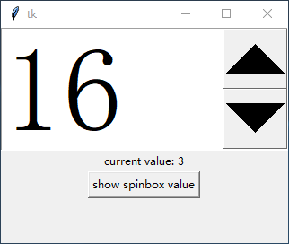
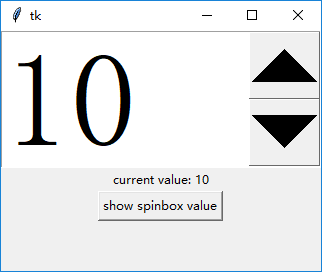
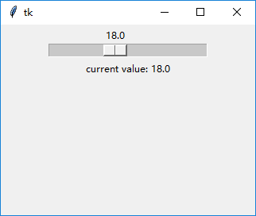
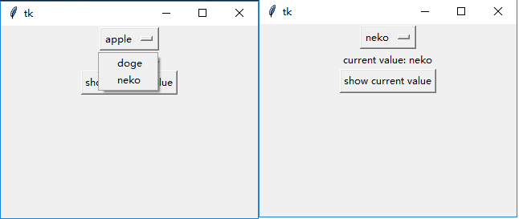

### 一些用于特定输入的控件

此节应该是最后一个介绍“简单”控件的章节了。

这些组件看起来已经有些过时了，即使不使用它们，一般也能很好地构建tkinter应用。

所以建议诸位跳过此节，等有需要的时候再看。

------------------------------
1. `tk.Spinbox`

    此控件可以用来限制用户输入整数。默认的按钮太小了，所以设置了一下字体大小。
    
    可以使用`from_`属性和`to`属性限制输入范围(非强制，用户直接输入可以越界)：
    
        sb = tk.Spinbox(root, from_=1, to=30, font=font.Font(size=100))
        sb.pack()
        # 用来显示Spinbox当前值的label
        label = tk.Label(root, text="current value: ")
        label.pack()
        # 点击按钮显示Spinbox当前值
        def btn_callback():
            label.config(text="current value: {}".format(sb.get()))
        tk.Button(root, text="show spinbox value",command=btn_callback).pack()

    
    
    也可以使用`values`属性指定输入范围(非强制，用户直接输入可以越界)：
    
        sb = tk.Spinbox(root, values=[-1, 2, 3, 10], font=font.Font(size=100))
        sb.pack()
        # 用来显示Spinbox当前值的label
        label = tk.Label(root, text="current value: ")
        label.pack()
        # 点击按钮显示Spinbox当前值
        def btn_callback():
            label.config(text="current value: {}".format(sb.get()))
        tk.Button(root, text="show spinbox value", command=btn_callback).pack()
    
    
    
2. `tk.Scale`

    `tk.Scale`可以方便地生成一个限定范围的数字区间供用户选择。

    * `from_`：最小值
    * `to`：最大值
    * `resolution`：拖动步长
    * `length`：控件宽度(按像素计)
    * `orient`：指定方向(水平/竖直)
    * `command`：当用户拖动`Scale`中间小条的位置时会调用回调函数，且调用时附带一个参数，即当前`Scale`的值。
    
    此外，使用`Scale`的`get()`和`set()`方法可以查看和控制当前值。

        def callback(*args):
            v.set("current value: {}".format(s.get()))
        s = tk.Scale(root, from_=3, to=40, resolution=0.5, length=200, orient=tk.HORIZONTAL, command=callback)
        s.pack()
        tk.Label(root, textvariable=v).pack()  # 用于显示当前Scale的值的label
        callback()

    

3. `tk.OptionMenu`

    显示一个看起来很过时的下拉菜单
    
        v = tk.StringVar(value="apple")
        om = tk.OptionMenu(root, v, "doge", "neko")
        om.pack()
        # 显示当前OptionMenu的值
        label = tk.Label(root, text="current value")
        label.pack()
        def btn_callback():
            label.configure(text="current value: {}".format(v.get()))
        tk.Button(root, text="show current value", command=btn_callback).pack()
        
        