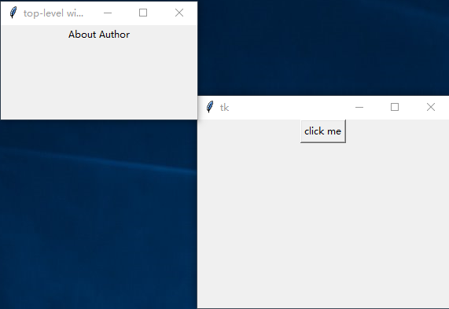

### Toplevel

Toplevel会显示出一个独立的窗口

---------------------------
### 使用模式

1. 点击按钮弹出

        root = tk.Tk()
        root.geometry("320x240+400+200")  # 设置主界面大小和位置
        # 点击主界面按钮弹出子界面
        def btn_callback():
            top = tk.Toplevel()
            top.title("top-level window")
            tk.Label(top, text="About Author").pack()
            top.geometry("250x120+150+80")  # 设置子界面大小和位置
        # 声明主界面按钮
        tk.Button(root, text="click me", command=btn_callback).pack()
    
    
        

