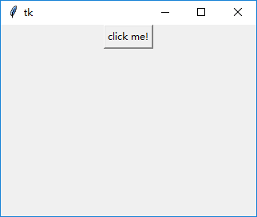
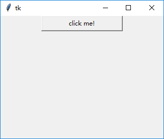
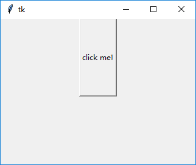
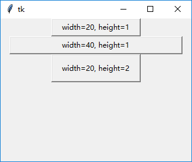
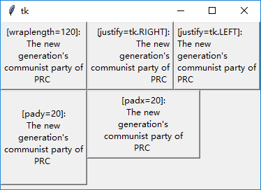

### 按钮(Button)

声明一个按钮是很简单的：

    btn = tk.Button(root, text="Click me!")
    
那么有什么关键词属性可以用呢？看看源码(只要看看`__init__`函数里面的注释就好)：

    class Button(Widget):
        """Button widget."""
        def __init__(self, master=None, cnf={}, **kw):
            """Construct a button widget with the parent MASTER.
    
            STANDARD OPTIONS
    
                activebackground, activeforeground, anchor,
                background, bitmap, borderwidth, cursor,
                disabledforeground, font, foreground
                highlightbackground, highlightcolor,
                highlightthickness, image, justify,
                padx, pady, relief, repeatdelay,
                repeatinterval, takefocus, text,
                textvariable, underline, wraplength
    
            WIDGET-SPECIFIC OPTIONS
    
                command, compound, default, height,
                overrelief, state, width
            """
            Widget.__init__(self, master, 'button', cnf, kw)
   
    def flash(self):
        """Flash the button.

        This is accomplished by redisplaying
        the button several times, alternating between active and
        normal colors. At the end of the flash the button is left
        in the same normal/active state as when the command was
        invoked. This command is ignored if the button's state is
        disabled.
        """
        self.tk.call(self._w, 'flash')

    def invoke(self):
        """Invoke the command associated with the button.

        The return value is the return value from the command,
        or an empty string if there is no command associated with
        the button. This command is ignored if the button's state
        is disabled.
        """
        return self.tk.call(self._w, 'invoke')
 
然后就可以用了

1. `padx`和`pady`属性
    
    如果在按钮的声明中没有指定按钮的大小，那么按钮就会把里面的内容包住，一般都是很小的。
    
    
    
    这个就类似于CSS中的`padding`属性，`padx`设置为10，那么就相当于`padding-left = 10px; padding-right=10px;`。
    
    `btn = tk.Button(root, text="click me!", padx=50)`的效果如下：
    
    
    
    `btn = tk.Button(root, text="click me!", pady=50)`的效果如下：
    
    
    
2. `width`和`height`属性
    
    指定按钮的宽和高。宽是按像素的，高是按行数。其实有方法按像素指定高度，但这里不提。
    
        tk.Button(root, text="width=20, height=1", width=20, height=1).pack()
        tk.Button(root, text="width=40, height=1", width=40, height=1).pack()
        tk.Button(root, text="width=20, height=2", width=20, height=2).pack()
        
        

3. `wraplength`和`justify`属性
    
    按钮可以显示多行文字,用`wraplength`指定每行最大宽度，然后`justify`就是左中右对齐用的：
    
        s = "The new generation's communist party of PRC "
        tk.Button(root, text="[wraplength=120]:\n" + s, wraplength=120).pack(side=tk.LEFT)
        tk.Button(root, text="[justify=tk.RIGHT]:\n" + s, wraplength=120, justify=tk.RIGHT).pack(side=tk.LEFT)
        tk.Button(root, text="[justify=tk.LEFT]:\n" + s, wraplength=120, justify=tk.LEFT).pack(side=tk.LEFT)

    
    
    
    
    
    
    
    

