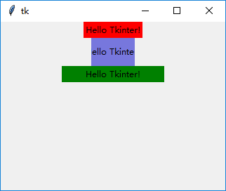
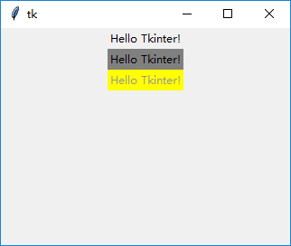
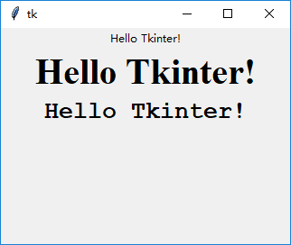

### 标签(Label)

---------------------------

### 声明：
    
    label = tk.Label(root, text="This is a label.")

### 可用属性：
    
    class Label(Widget):
        """Label widget which can display text and bitmaps."""
        def __init__(self, master=None, cnf={}, **kw):
            """Construct a label widget with the parent MASTER.
    
            STANDARD OPTIONS
    
                activebackground, activeforeground, anchor,
                background, bitmap, borderwidth, cursor,
                disabledforeground, font, foreground,
                highlightbackground, highlightcolor,
                highlightthickness, image, justify,
                padx, pady, relief, takefocus, text,
                textvariable, underline, wraplength
    
            WIDGET-SPECIFIC OPTIONS
    
                height, state, width
    
            """
            Widget.__init__(self, master, 'label', cnf, kw)
            
### 属性示例：

1. `height`和`width`:

    这两个属性决定了组件的宽和高(字符)。为了显示效果，使用`bg`设置了背景色

        tk.Label(root, text="Hello Tkinter!", bg="red").pack()
        tk.Label(root, text="Hello Tkinter!", width=8, height=2, bg="#7777dd").pack()
        tk.Label(root, text="Hello Tkinter!", width=20, height=1, bg="green").pack()
        
    
    
2. `bg`和`fg`:
    
    前景色和背景色
    
        tk.Label(root, text="Hello Tkinter!").pack()
        tk.Label(root, text="Hello Tkinter!", bg="gray").pack()
        tk.Label(root, text="Hello Tkinter!", fg="#999989", bg="yellow").pack()

    
    
3. `font`:

    设置字体样式
    
        tk.Label(root, text="Hello Tkinter!").pack()
        from tkinter.font import Font
        tk.Label(root, text="Hello Tkinter!", font=Font(family="times", size=30, weight=font.BOLD)).pack()
        tk.Label(root, text="Hello Tkinter!", font=("Courier", 20, "bold")).pack()
    
    
     
    
   