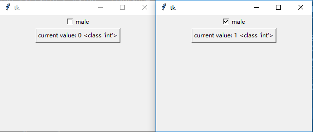

### 复选框(Checkbutton)

---------------------------

### 声明：

    chk_btn = tk.Checkbutton(root, text="male", variable=my_intvar)

### 可用属性：
    
    class Checkbutton(Widget):
        """Checkbutton widget which is either in on- or off-state."""
        def __init__(self, master=None, cnf={}, **kw):
            """Construct a checkbutton widget with the parent MASTER.

            Valid resource names: activebackground, activeforeground, anchor,
            background, bd, bg, bitmap, borderwidth, command, cursor,
            disabledforeground, fg, font, foreground, height,
            highlightbackground, highlightcolor, highlightthickness, image,
            indicatoron, justify, offvalue, onvalue, padx, pady, relief,
            selectcolor, selectimage, state, takefocus, text, textvariable,
            underline, variable, width, wraplength."""
            Widget.__init__(self, master, 'checkbutton', cnf, kw)
        def deselect(self):
            """Put the button in off-state."""
            self.tk.call(self._w, 'deselect')
        def flash(self):
            """Flash the button."""
            self.tk.call(self._w, 'flash')
        def invoke(self):
            """Toggle the button and invoke a command if given as resource."""
            return self.tk.call(self._w, 'invoke')
        def select(self):
            """Put the button in on-state."""
            self.tk.call(self._w, 'select')
        def toggle(self):
            """Toggle the button."""
            self.tk.call(self._w, 'toggle')
    
### 属性示例:

1. `variable`

    一般来说，使用Checkbutton这个组件需要声明一个变量来追踪或者改变其状态。
    
    得到Checkbutton的状态可以通过其绑定的值来得到。默认未选中是0，选中是1。
    而改变Checkbutton的状态可以通过设置其绑定的值来得到。 
        
        # 这个就是声明的变量
        my_intvar = tk.IntVar()
        # 这个是复选按钮
        chk_btn = tk.Checkbutton(root, text="male", variable=my_intvar)
        chk_btn.pack()
        # 然后添加一个按钮，其文字在按下时被设置为声明变量的值
        def _callback():
            _value = my_intvar.get()
            demo_btn.config(text="current value: {} {}".format(_value, type(_value)))
        demo_btn = tk.Button(root, text="show the variable's value", command=_callback)
        demo_btn.pack()

    