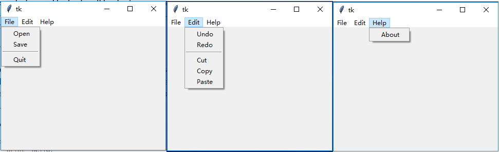
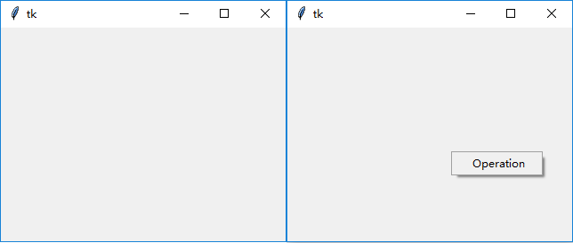

### 菜单(Menu)

----------------------

### 使用模式：

1. 普通菜单
    
使用`add_command()`方法添加菜单项,`add_cascade()`嵌套菜单。常用方法如下：

    menubar = tk.Menu(root)

    # file menu
    filemenu = tk.Menu(menubar, tearoff=0)
    filemenu.add_command(label="Open", command=lambda: print("Open"))
    filemenu.add_command(label="Save", command=lambda: print("Save"))
    filemenu.add_separator()
    filemenu.add_command(label="Quit", command=root.quit)
    menubar.add_cascade(label="File", menu=filemenu)
    
    # Edit Menu
    editmenu = tk.Menu(menubar, tearoff=0)
    editmenu.add_command(label="Undo", command=lambda: print("Undo"))
    editmenu.add_command(label="Redo", command=lambda: print("Redo"))
    editmenu.add_separator()
    editmenu.add_command(label="Cut", command=lambda: print("Cut"))
    editmenu.add_command(label="Copy", command=lambda: print("Copy"))
    editmenu.add_command(label="Paste", command=lambda: print("Paste"))
    menubar.add_cascade(label="Edit", menu=editmenu)
    
    # help menu
    helpmenu = tk.Menu(menubar, tearoff=0)
    helpmenu.add_command(label="About", command=lambda: print("About"))
    menubar.add_cascade(label="Help", menu=helpmenu)
    
    root.config(menu=menubar)

2. 弹出菜单

和通常的菜单栏不同，使用`post()`方法弹出菜单：
    
    # 绑定鼠标右键
    root.bind("<Button-3>", lambda event: menu.post(event.x_root, event.y_root))
    
    # 定义弹出菜单
    menu = tk.Menu(root, tearoff=0)
    menu.add_command(label="Operation", command=lambda: print("Operation"))

