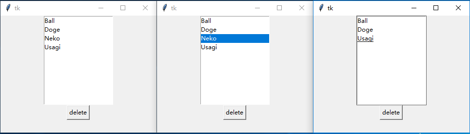
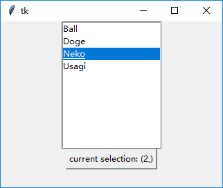
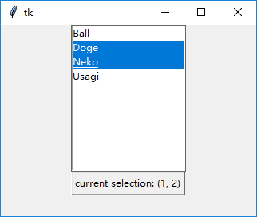

### 列表框(Listbox)

-----------------------------

### 声明：
    
    listbox = tk.Listbox(root)
    
### 使用模式：

1. 使用`insert()`方法插入

    一般使用`tk.END`在列表末尾插入项
        
        listbox = tk.Listbox(root)
        listbox.pack()
        listbox.insert(tk.END, "Ball")
        listbox.insert(tk.END, "Doge")
        listbox.insert(tk.END, "Neko")
        listbox.insert(tk.END, "Usagi")
    
    
    
2. 使用`delete()`方法删除
    
    可以对函数`delete(self, first, last=None)`传入`first`和`last`，
    从而删除所有从`first`到`last`的项(包括`last`)：
    
        listbox.insert(tk.END, "Ball")
        listbox.insert(tk.END, "Doge")
        listbox.insert(tk.END, "Neko")
        listbox.insert(tk.END, "Usagi")
        listbox.delete(0, tk.END)
    
    
    
    也可以省略`last`参数，从而删除特定项。可以使用`tk.ANCHOR`实现点击按钮删除所选项：
    
        listbox.insert(tk.END, "Ball")
        listbox.insert(tk.END, "Doge")
        listbox.insert(tk.END, "Neko")
        listbox.insert(tk.END, "Usagi")
        tk.Button(root, text="delete", command=lambda *args: listbox.delete(tk.ANCHOR)).pack()
        
    
    
3. 使用`curselection()`方法获得当前用户选择项的列表
    
    返回的列表是一个`int`类型组成的`tuple`，从零开始计数
    
        listbox.insert(tk.END, "Ball")
        listbox.insert(tk.END, "Doge")
        listbox.insert(tk.END, "Neko")
        listbox.insert(tk.END, "Usagi")
        def btn_callback():
            btn['text'] = "current selection: " + str(listbox.curselection())
        btn = tk.Button(root, text="show selection", command=btn_callback)
        btn.pack()
    
    

4. 属性`selectmode`

    从单选到多选依次为：
    
    `tk.SINGLE`     ：单选，只能通过鼠标单击改变选定项
    
    `tk.BROWSE`     ：单选，除通过鼠标单击改变选定项外，还能通过鼠标拖动改变选定项
    
    `tk.MULTIPLE`   ：多选，只能通过鼠标单击改变选定项
    
    `tk.EXTENDED`   ：多选，除通过鼠标单击改变选定项外，还能响应鼠标拖动、`Ctrl`和`Shift`
    
        listbox = tk.Listbox(root, selectmode=tk.EXTENDED)
        listbox.pack()
        listbox.insert(tk.END, "Ball")
        listbox.insert(tk.END, "Doge")
        listbox.insert(tk.END, "Neko")
        listbox.insert(tk.END, "Usagi")
    
    

### 可用属性：

    class Listbox(Widget, XView, YView):
        """Listbox widget which can display a list of strings."""
        def __init__(self, master=None, cnf={}, **kw):
            """Construct a listbox widget with the parent MASTER.
    
            Valid resource names: background, bd, bg, borderwidth, cursor,
            exportselection, fg, font, foreground, height, highlightbackground,
            highlightcolor, highlightthickness, relief, selectbackground,
            selectborderwidth, selectforeground, selectmode, setgrid, takefocus,
            width, xscrollcommand, yscrollcommand, listvariable."""
            Widget.__init__(self, master, 'listbox', cnf, kw)
        def activate(self, index):
            """Activate item identified by INDEX."""
            self.tk.call(self._w, 'activate', index)
        def bbox(self, index):
            """Return a tuple of X1,Y1,X2,Y2 coordinates for a rectangle
            which encloses the item identified by the given index."""
            return self._getints(self.tk.call(self._w, 'bbox', index)) or None
        def curselection(self):
            """Return the indices of currently selected item."""
            return self._getints(self.tk.call(self._w, 'curselection')) or ()
        def delete(self, first, last=None):
            """Delete items from FIRST to LAST (included)."""
            self.tk.call(self._w, 'delete', first, last)
        def get(self, first, last=None):
            """Get list of items from FIRST to LAST (included)."""
            if last is not None:
                return self.tk.splitlist(self.tk.call(
                    self._w, 'get', first, last))
            else:
                return self.tk.call(self._w, 'get', first)
        def index(self, index):
            """Return index of item identified with INDEX."""
            i = self.tk.call(self._w, 'index', index)
            if i == 'none': return None
            return self.tk.getint(i)
        def insert(self, index, *elements):
            """Insert ELEMENTS at INDEX."""
            self.tk.call((self._w, 'insert', index) + elements)
        def nearest(self, y):
            """Get index of item which is nearest to y coordinate Y."""
            return self.tk.getint(self.tk.call(
                self._w, 'nearest', y))
        def scan_mark(self, x, y):
            """Remember the current X, Y coordinates."""
            self.tk.call(self._w, 'scan', 'mark', x, y)
        def scan_dragto(self, x, y):
            """Adjust the view of the listbox to 10 times the
            difference between X and Y and the coordinates given in
            scan_mark."""
            self.tk.call(self._w, 'scan', 'dragto', x, y)
        def see(self, index):
            """Scroll such that INDEX is visible."""
            self.tk.call(self._w, 'see', index)
        def selection_anchor(self, index):
            """Set the fixed end oft the selection to INDEX."""
            self.tk.call(self._w, 'selection', 'anchor', index)
        select_anchor = selection_anchor
        def selection_clear(self, first, last=None):
            """Clear the selection from FIRST to LAST (included)."""
            self.tk.call(self._w,
                     'selection', 'clear', first, last)
        select_clear = selection_clear
        def selection_includes(self, index):
            """Return 1 if INDEX is part of the selection."""
            return self.tk.getboolean(self.tk.call(
                self._w, 'selection', 'includes', index))
        select_includes = selection_includes
        def selection_set(self, first, last=None):
            """Set the selection from FIRST to LAST (included) without
            changing the currently selected elements."""
            self.tk.call(self._w, 'selection', 'set', first, last)
        select_set = selection_set
        def size(self):
            """Return the number of elements in the listbox."""
            return self.tk.getint(self.tk.call(self._w, 'size'))
        def itemcget(self, index, option):
            """Return the resource value for an ITEM and an OPTION."""
            return self.tk.call(
                (self._w, 'itemcget') + (index, '-'+option))
        def itemconfigure(self, index, cnf=None, **kw):
            """Configure resources of an ITEM.
    
            The values for resources are specified as keyword arguments.
            To get an overview about the allowed keyword arguments
            call the method without arguments.
            Valid resource names: background, bg, foreground, fg,
            selectbackground, selectforeground."""
            return self._configure(('itemconfigure', index), cnf, kw)
        itemconfig = itemconfigure

    