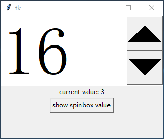
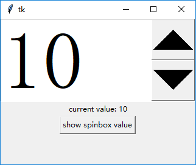

### 一些用于特定输入的控件

------------------------------

1. `tk.Spinbox`

    此控件可以用来限制用户输入整数。默认的按钮太小了，所以设置了一下字体大小。
    
    可以使用`from_`属性和`to`属性限制输入范围(非强制，用户直接输入可以越界)：
    
        sb = tk.Spinbox(root, from_=1, to=30, font=font.Font(size=100))
        sb.pack()
        # 用来显示Spinbox当前值的label
        label = tk.Label(root, text="current value: ")
        label.pack()
        # 点击按钮显示Spinbox当前值
        def btn_callback():
            label.config(text="current value: {}".format(sb.get()))
        tk.Button(root, text="show spinbox value",command=btn_callback).pack()

    
    
    也可以使用`values`属性指定输入范围(非强制，用户直接输入可以越界)：
    
    (非强制，用户直接输入可以越界)：
    
        sb = tk.Spinbox(root, values=[-1, 2, 3, 10], font=font.Font(size=100))
        sb.pack()
        # 用来显示Spinbox当前值的label
        label = tk.Label(root, text="current value: ")
        label.pack()
        # 点击按钮显示Spinbox当前值
        def btn_callback():
            label.config(text="current value: {}".format(sb.get()))
        tk.Button(root, text="show spinbox value", command=btn_callback).pack()
    
    