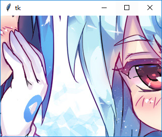

### PhotoImage

--------------------------------------

1. 结合PIL显示图片

    由于PhotoImage支持的图片种类不多，所以结合PIL显示图片
    
    注意！如果不对PhotoImage对象进行引用，那么就会被垃圾回收器销毁，图片会无法显示
    
        from PIL import Image, ImageTk
        photo = ImageTk.PhotoImage(Image.open(r"C:\Users\anonymous\PycharmProjects\mytkintertutorial\chapter_2_Widget\static\77654ffb2eabc662ee1dc5651ec31991.jpg"))
        tk.Label(root, image=photo).pack()

    

    [original image](static/1d1aff21e24fae85b603cf6dae818a9b.png)
