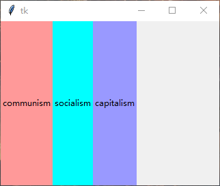

### pack布局

`tkinter`支持三种布局管理方式`pack`，`grid`和`place`。首先从`pack`开始介绍。

---------------------

1. 不使用任何参数

`pack`类似于浏览器中的流式布局，不需要指定具体位置而是自适应排列控件。

如果使用`pack()`时不加任何参数，那么就会垂直排列，并且每个控件都水平居中。

    label_1 = tk.Label(root, text="communism", bg="#ff9999")
    label_1.pack()
    label_2 = tk.Label(root, text="socialism", bg="cyan")
    label_2.pack()
    label_3 = tk.Label(root, text="capitalism", bg="#9999ff")
    label_3.pack()

2. `side`参数

使用`side`参数可以改变控件的排列方式

`side`参数有4种：`tk.TOP`, `tk.BOTTOM`, `tk.LEFT`和`tk.RIGHT`,默认为`tk.TOP`

    # 仅给出从左到右排列(`tk.LEFT`)的代码
    label_1 = tk.Label(root, text="communism(LEFT)", bg="#ff9999")
    label_1.pack(side=tk.LEFT)
    label_2 = tk.Label(root, text="socialism(LEFT)", bg="cyan")
    label_2.pack(side=tk.LEFT)
    label_3 = tk.Label(root, text="capitalism(LEFT)", bg="#9999ff")
    label_3.pack(side=tk.LEFT)
    

3. `fill`和`expand`参数

使用`fill`参数可以将每个控件的宽度/高度统一，共三种:`tk.X`，`tk.Y`，`tk.BOTH`

当`side`属性为`tk.TOP`(默认)或者`tk.BOTTOM`时，`fill`只能向水平方向填充：

    label_1 = tk.Label(root, text="communism", bg="#ff9999")
    label_1.pack(fill=tk.X)
    label_2 = tk.Label(root, text="socialism", bg="cyan")
    label_2.pack(fill=tk.X)
    label_3 = tk.Label(root, text="capitalism", bg="#9999ff")
    label_3.pack(fill=tk.X)

当`side`属性为`tk.LEFT`或者`tk.RIGHT`时，`fill`只能向垂直方向填充：

    label_1 = tk.Label(root, text="communism", bg="#ff9999")
    label_1.pack(fill=tk.Y, side=tk.LEFT)
    label_2 = tk.Label(root, text="socialism", bg="cyan")
    label_2.pack(fill=tk.Y, side=tk.LEFT)
    label_3 = tk.Label(root, text="capitalism", bg="#9999ff")
    label_3.pack(fill=tk.Y, side=tk.LEFT)

而`expand`属性设置为1的时候，`side`属性无效，控件默认居中，此时可以使用`fill`充填水平或垂直方向。

        label_1 = tk.Label(root, text="communism", bg="#ff9999")
        label_1.pack(expand=1, fill=tk.X)
        label_2 = tk.Label(root, text="socialism", bg="cyan")
        label_2.pack(expand=1, fill=tk.Y)
        label_3 = tk.Label(root, text="capitalism", bg="#9999ff")
        label_3.pack(expand=1, fill=tk.BOTH)
        

4. `padx`, `pady`，`ipadx`，`ipady`参数

`padx`： 类似于CSS中`margin-left` +  `margin-right`，即左外边距和右外边距

`pady`： 类似于CSS中`margin-top` + `margin-bottom`，即上外边距和下外边距

`ipadx`：类似于CSS中`padding-left` + `padding-right`，即左内边距和右内边距

`ipady`：类似于CSS中`padding-top` + `padding-bottom`，即上内边距和下内边距

注意和CSS样式的不同是，margin不会折叠（下例）

    label_1 = tk.Label(root, text="communism", bg="#ff9999")
    label_1.pack(pady=30)
    label_2 = tk.Label(root, text="socialism", bg="cyan")
    label_2.pack(pady=30)
    label_3 = tk.Label(root, text="capitalism", bg="#9999ff")
    label_3.pack()
    

