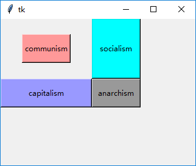
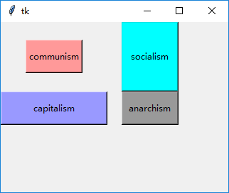
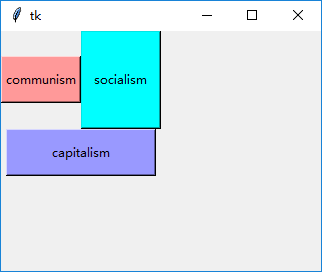
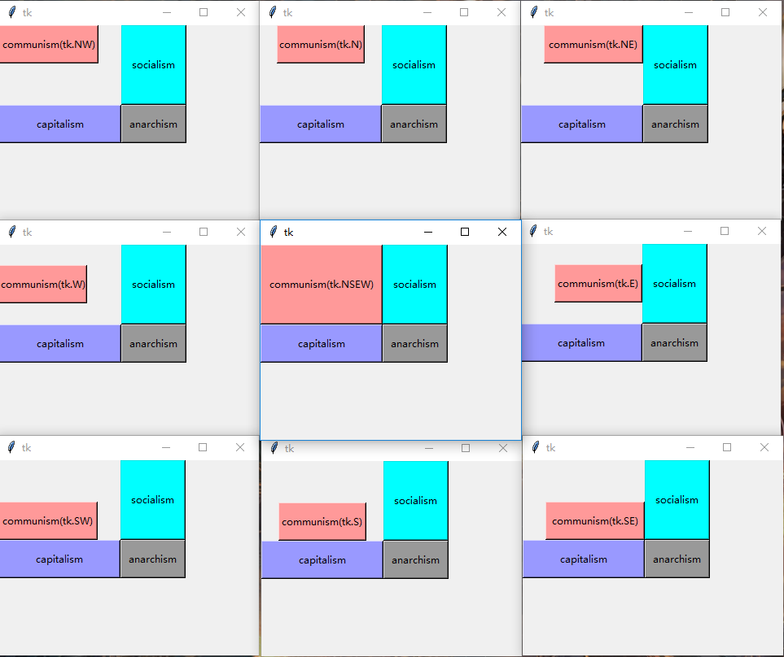

### grid布局

----------------------------------------------

1. `row`和`column`

    `row`和`column`的值从0开始
    
    单元格的宽度由同一列最宽的控件决定。单元格高度由同一行中最高的控件决定。
    
        tk.Button(root, text="communism", width=10, height=2, bg="#ff9999").grid(row=0, column=0)
        tk.Button(root, text="socialism", width=10, height=5, bg="#00ffff").grid(row=0, column=1)
        tk.Button(root, text="capitalism", width=20, height=2, bg="#9999ff").grid(row=1, column=0)
        tk.Button(root, text="anarchism", width=10, height=2, bg="#999999").grid(row=1, column=1)
        
    
    
    
2. `padx`，`pady`，`ipadx`和`ipady` 
    
    同`pack`中用法相同
    
        # 第四个按钮左右边距20像素
        tk.Button(root, text="communism", width=10, height=2, bg="#ff9999").grid(row=0, column=0)
        tk.Button(root, text="socialism", width=10, height=5, bg="#00ffff").grid(row=0, column=1)
        tk.Button(root, text="capitalism", width=20, height=2, bg="#9999ff").grid(row=1, column=0)
        tk.Button(root, text="anarchism", width=10, height=2, bg="#999999").grid(row=1, column=1, padx=20)

    

3. `rowspan`和`columnspan`

    使用`rowspan`指定控件在竖直方向占用单元格数量
    
    使用`columnspan`指定控件在水平方向占用单元格数量
    
        # 第三个按钮横跨两列
        tk.Button(root, text="communism", width=10, height=2, bg="#ff9999").grid(row=0, column=0)
        tk.Button(root, text="socialism", width=10, height=5, bg="#00ffff").grid(row=0, column=1)
        tk.Button(root, text="capitalism", width=20, height=2, bg="#9999ff").grid(row=1, column=0, columnspan=2)

    
    
4. `sticky`

    `sticky`控制控件的对齐方式，可选值为`tk.N`，`tk.S`,`tk.E`和`tk.W`及其组合。
    
    如果在相对方向上指定(`tk.NS`，`tk.EW`，`tk.NSEW`)，那么会有填充效果。
    
        tk.Button(root, text="communism(tk.NSEW)", width=16, height=2, bg="#ff9999").grid(row=0, column=0, sticky=tk.NSEW)
        tk.Button(root, text="socialism", width=10, height=5, bg="#00ffff").grid(row=0, column=1)
        tk.Button(root, text="capitalism", width=20, height=2, bg="#9999ff").grid(row=1, column=0)
        tk.Button(root, text="anarchism", width=10, height=2, bg="#999999").grid(row=1, column=1)
        
    

