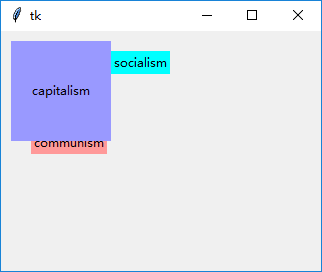
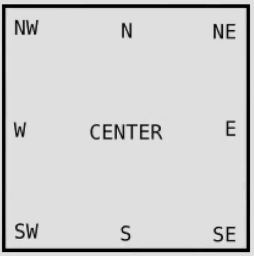
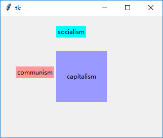

### place布局
使用`place`布局直接指定控件相对于父控件的位置。不建议使用。
--------------------

1. `x`，`y`, `width`, `height`属性

    使用`x`，`y`属性指定控件的绝对坐标
    
    使用`width`，`height`属性指定控件的大小

        label_1 = tk.Label(root, text="communism", bg="#ff9999")
        label_1.place(x=30, y=100)
        label_2 = tk.Label(root, text="socialism", bg="cyan")
        label_2.place(x=110, y=20)
        label_3 = tk.Label(root, text="capitalism", bg="#9999ff")
        label_3.place(x=10, y=10, width=100, height=100)

2. `relx`, `rely`, `anchor`属性
    
    使用`relx`, `rely`属性指定百分比绝对坐标(范围从0到1)
    
    而`anchor`属性指定了控件的哪一个部分出现在你指定的座标上:
    
    
    
        # 将第三个label移到窗口中心
        label_1 = tk.Label(root, text="communism", bg="#ff9999")
        label_1.place(x=30, y=100)
        label_2 = tk.Label(root, text="socialism", bg="cyan")
        label_2.place(x=110, y=20)
        label_3 = tk.Label(root, text="capitalism", bg="#9999ff")
        label_3.place(relx=0.5, rely=0.5, anchor=tk.CENTER, width=100, height=100)
        
    
