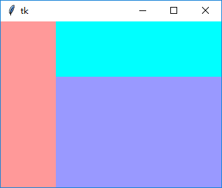
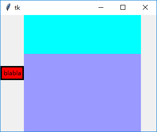
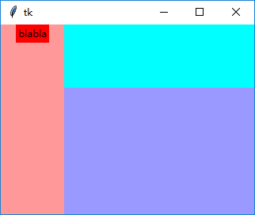

### Frame

使用`Frame`可以构建复杂布局。

----------------------------------

1. `width`，`height`

    使用`width`，`height`设置Frame的宽度和高度
    
        frame_1 = tk.Frame(root, bg="#ff9999", height=240, width=80)
        frame_1.grid(row=0, column=0, rowspan=2)
        frame_2 = tk.Frame(root, bg="#00ffff", height=80, width=240)
        frame_2.grid(row=0, column=1)
        frame_3 = tk.Frame(root, bg="#9999ff", height=160, width=240)
        frame_3.grid(row=1, column=1)
    
    
    
    
2. 使用`propagate()`函数避免`Frame`“塌陷”

    如果接着上例，添加一个小控件，`Frame`默认是要根据子控件改变大小的：
    
        frame_1 = tk.Frame(root, bg="#ff9999", height=240, width=80)
        frame_1.grid(row=0, column=0, rowspan=2)
        frame_2 = tk.Frame(root, bg="#00ffff", height=80, width=240)
        frame_2.grid(row=0, column=1)
        frame_3 = tk.Frame(root, bg="#9999ff", height=160, width=240)
        frame_3.grid(row=1, column=1)
        
        frame_1.configure(border=3, bg="black")  # 便于观察
        side_label_1 = tk.Label(frame_1, text="blabla", bg="red")
        side_label_1.pack()

    
    
    这时需要`propagate()`函数设定`Frame`不要根据子控件改变大小：
    
        frame_1 = tk.Frame(root, bg="#ff9999", height=240, width=80)
        frame_1.grid(row=0, column=0, rowspan=2)
        frame_2 = tk.Frame(root, bg="#00ffff", height=80, width=240)
        frame_2.grid(row=0, column=1)
        frame_3 = tk.Frame(root, bg="#9999ff", height=160, width=240)
        frame_3.grid(row=1, column=1)
        
        frame_1.propagate(False)
        side_label_1 = tk.Label(frame_1, text="blabla", bg="red")
        side_label_1.pack()
        
    