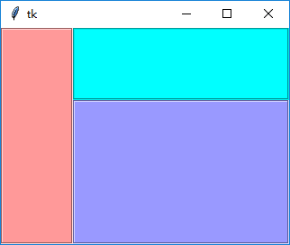
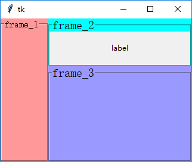

### LabelFrame

--------------------------
1. 直接使用

    将`Frame`直接换成`LabelFrmae`，可以发现多了一圈边框。

        frame_1 = tk.LabelFrame(root, bg="#ff9999", height=240, width=80)
        frame_1.grid(row=0, column=0, rowspan=2)
        frame_2 = tk.LabelFrame(root, bg="#00ffff", height=80, width=240)
        frame_2.grid(row=0, column=1)
        frame_3 = tk.LabelFrame(root, bg="#9999ff", height=160, width=240)
        frame_3.grid(row=1, column=1)
    
    
    
    
2. `text`属性

    指定`text`属性后，左上方会相应文字出现。
    
    为了凸显文字和边框的相对位置，在其中一个`Frame`中添加了一个`Label`：
    
        frame_1 = tk.LabelFrame(root, bg="#ff9999", height=240, width=80, text="frame_1", font=font.Font(size=12))
        frame_1.grid(row=0, column=0, rowspan=2)
        frame_2 = tk.LabelFrame(root, bg="#00ffff", height=80, width=240, text="frame_2", font=font.Font(size=15))
        frame_2.grid(row=0, column=1)
        frame_3 = tk.LabelFrame(root, bg="#9999ff", height=160, width=240, text="frame_3", font=font.Font(size=15))
        frame_3.grid(row=1, column=1)
        
        frame_2.propagate(False)
        tk.Label(frame_2, text="label").pack(expand=1, fill=tk.BOTH)

    
