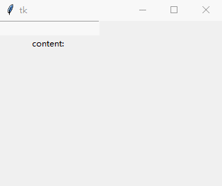

### Entry

`Entry`被用来设计输入单行文本

----------------------------

1. 设置`textvariable`属性获得输入框内容

    绑定一个变量到`tk.Entry`实例的`textvariable`属性上，然后对变量使用`get()`方法：
    
        # 用来绑定Entry的变量
        v = tk.StringVar()
        tk.Entry(root, textvariable=v).grid(row=0, column=0, padx=10, pady=10)
        # 按钮回调函数
        def btn_callback():
            label['text'] = 'content: {}'.format(v.get())
        tk.Button(root, text="click", command=btn_callback).grid(row=0, column=1)
        # 用来显示内容的Label
        label = tk.Label(root, text="content: ")
        label.grid(row=1, column=0)
    
    
    

2. 使用`font`属性改变输入框大小

    不能使用`height`属性设置高度。但是可以设置其字体大小从而间接改变输入框大小：
    
        # 用来绑定Entry的变量
        v = tk.StringVar()
        tk.Entry(root, textvariable=v, font=tk.font.Font(size=18)).grid(row=0, column=0, padx=10, pady=10)
        # 按钮回调函数
        def btn_callback():
            label['text'] = 'content: {}'.format(v.get())
        tk.Button(root, text="click", command=btn_callback).grid(row=0, column=1)
        # 用来显示内容的Label
        label = tk.Label(root, text="content: ")
        label.grid(row=1, column=0)
    
    
    
    
3. 设置`show`属性作为密码输入框

    `show`属性决定了用户输入一个字符以后在`Entry`中如何显示：

        # 用来绑定Entry的变量
        v = tk.StringVar()
        tk.Entry(root, textvariable=v, font=tk.font.Font(size=18), show="*").grid(row=0, column=0, padx=10, pady=10)
        # 按钮回调函数
        def btn_callback():
            label['text'] = 'content: {}'.format(v.get())
        tk.Button(root, text="click", command=btn_callback).grid(row=0, column=1)
        # 用来显示内容的Label
        label = tk.Label(root, text="content: ")
        label.grid(row=1, column=0)
        
    

4. 设置`validate`，`validatecommand`和`invalidcommand`选项验证输入内容

    `validate`负责何时调用`validatecommand`属性绑定的回调函数。共有6种模式：
    
        key：当Entry控件被编辑的时候调用
        focus：当Entry控件获得焦点或者失去焦点时调用
        focusin：当Entry控件获得焦点时调用
        focusout：当Entry控件失去焦点时调用
        all：上述所有情况都调用
        none：上述所有情况都不调用
    
    下例实现了当用户输入一个字符，就调用一次`validatecommand()`函数：
    
        # 验证用户输入的回调函数
        def validate_callback():
            label['text'] += "\n{}".format(validate_callback)
            return True
        # 用来绑定Entry的变量
        v = tk.StringVar()
        entry = tk.Entry(root, textvariable=v, validate="key", validatecommand=validate_callback)
        entry.grid(row=0, column=0)
        # Label
        label = tk.Label(root, text="content: ")
        label.grid(row=1, column=0)
        
    
    
    属性`validatecommand`绑定的回调函数被调用后，
    
    如果返回`True`或者其它非`False`值，那么用户的输入就会正常显示在`Entry`中；
    
    如果返回`False`，那么用户的输入就会被废弃掉，并调用`invalidcommand`属性绑定的回调函数(如果有的话)：
    
        # 验证用户输入的回调函数
        def validate_callback():
            label['text'] += "\n{}".format(validate_callback)
            return False  # 这里硬编码为返回False，意味着一定验证失败，因此实际上用户不能输入任何字符。
        # 验证失败的回调函数
        def invalid_callback():
            label['text'] += "\n{}".format(invalid_callback)
        # 用来绑定Entry的变量
        v = tk.StringVar()
        entry = tk.Entry(root, textvariable=v, validate="key", validatecommand=validate_callback, invalidcommand=invalid_callback)
        entry.grid(row=0, column=0)
        # Label
        label = tk.Label(root, text="content: ")
        label.grid(row=1, column=0)
    
    
    
    但是这样并不能实现实时验证用户输入。比如我们的目标是让用户只输入数字。当用户首先输入了`2018`，接着输入了一个非数字(比如"年")的时候，
    `validate_callback()`被调用，而此时无论通过`v.get()`只能得到字符串`2014`，并不能得到用户当前要输入的字符，
    从而无从判断！解决方法是对验证函数使用`root.register()`进行包装(可以理解成装饰器)。
    
    格式为：`validatecommand = root.register(validate_callback, param1, param2, ...)`，
    调用时`param1`，`param2...`会被传入到`validate_callback`中
    
    可选参数如下(本例仅使用`%P`参数)：
        
        '%P'    该值为Entry的最新文本内容
        
        '%d'    操作代码。0 表示删除操作，1 表示插入操作，2 表示获得、失去焦点或textvariable变量的值被修改 
        '%i'    用户插入或删除的位置(索引号)。如果是由于获得、失去焦点或textvariable变量的值被修改而调用验证函数，那么该值是-1
        '%s'    调用validate_callback前输入框的文本内容 
        '%S'    文本被插入和删除的内容(仅当插入或删除操作触发validate_callback时有效)
        '%v'    Entry当前validate选项的值 
        '%V'    调用validate_callback的原因。值为 'focusin'，'focusout'，'key' 或 'forced'(textvariable)选项指定的变量值被修改）中的一个 
        '%W'    Entry当前的的名字 
         
    

    
    
    