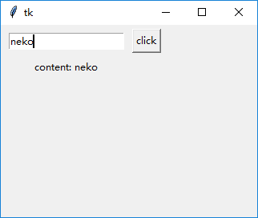
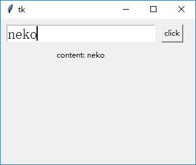
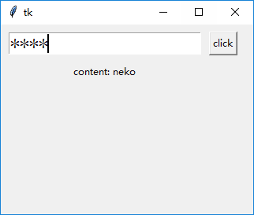
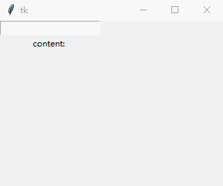

### Entry

`Entry`被用来设计输入单行文本

----------------------------

1. 设置`textvariable`属性获得输入框内容

    绑定一个变量到`tk.Entry`实例的`textvariable`属性上，然后对变量使用`get()`方法：
    
        # 用来绑定Entry的变量
        v = tk.StringVar()
        tk.Entry(root, textvariable=v).grid(row=0, column=0, padx=10, pady=10)
        # 按钮回调函数
        def btn_callback():
            label['text'] = 'content: {}'.format(v.get())
        tk.Button(root, text="click", command=btn_callback).grid(row=0, column=1)
        # 用来显示内容的Label
        label = tk.Label(root, text="content: ")
        label.grid(row=1, column=0)
    
    
    

2. 使用`font`属性改变输入框大小

    不能使用`height`属性设置高度。但是可以设置其字体大小从而间接改变输入框大小：
    
        # 用来绑定Entry的变量
        v = tk.StringVar()
        tk.Entry(root, textvariable=v, font=tk.font.Font(size=18)).grid(row=0, column=0, padx=10, pady=10)
        # 按钮回调函数
        def btn_callback():
            label['text'] = 'content: {}'.format(v.get())
        tk.Button(root, text="click", command=btn_callback).grid(row=0, column=1)
        # 用来显示内容的Label
        label = tk.Label(root, text="content: ")
        label.grid(row=1, column=0)
    
    
    
    
3. 设置`show`属性作为密码输入框

    `show`属性决定了用户输入一个字符以后在`Entry`中如何显示：

        # 用来绑定Entry的变量
        v = tk.StringVar()
        tk.Entry(root, textvariable=v, font=tk.font.Font(size=18), show="*").grid(row=0, column=0, padx=10, pady=10)
        # 按钮回调函数
        def btn_callback():
            label['text'] = 'content: {}'.format(v.get())
        tk.Button(root, text="click", command=btn_callback).grid(row=0, column=1)
        # 用来显示内容的Label
        label = tk.Label(root, text="content: ")
        label.grid(row=1, column=0)
        
    

4. 设置`validate`，`validatecommand`和`invalidcommand`选项验证输入内容

    `validate`负责何时调用`validatecommand`属性绑定的回调函数。共有6种模式：
    
        key：当Entry控件被编辑的时候调用
        focus：当Entry控件获得焦点或者失去焦点时调用
        focusin：当Entry控件获得焦点时调用
        focusout：当Entry控件失去焦点时调用
        all：上述所有情况都调用
        none：上述所有情况都不调用
    
    下例实现了当用户输入一个字符，就调用一次`validatecommand()`函数
    
        # 验证用户输入的回调函数
        def validate_callback():
            label['text'] += "\n{}".format(validate_callback)
            return True
        # 用来绑定Entry的变量
        v = tk.StringVar()
        entry = tk.Entry(root, textvariable=v, validate="key", validatecommand=validate_callback)
        entry.grid(row=0, column=0)
        # Label
        label = tk.Label(root, text="content: ")
        label.grid(row=1, column=0)
        
    
    
    属性`validatecommand`绑定的回调函数被调用后，
    
    如果返回`True`或者其它非`False`值，那么用户的输入就会正常显示在`Entry`中；
    
    如果返回`False`，那么用户的输入就会被废弃掉，并调用`invalidcommand`属性绑定的回调函数(如果有的话)
    
    
    