### Text

Text被设计用来显示多行文字。和Entry不同的是，Text中的文字可以以不同的字体、大小显示，还可以显示图片、窗口

-----------------------

1. 设置`width`和`height`属性

    `width`和`height`属性设定了`tk.Text`的宽和高(按字符计)
    
        tk.Text(root, width=30, height=12).pack()
    
    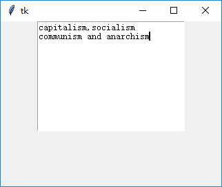
    
2. 设置`font`属性

    `font`属性可以改变字体的种类和样式，此外还可以改变字体的大小，从而间接改变`tk.Text`的大小：
    
        tk.Text(root, width=30, height=12, font=tk.font.Font(size=13)).pack()
    
    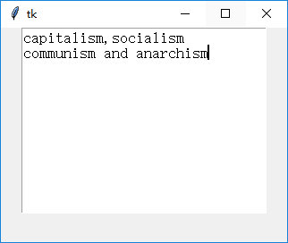

3. 设置`borderwidth`属性

    有时不需要显示`tk.Text`的边框(默认为2像素)
    
        tk.Text(root, width=30, height=12, borderwidth=0).pack()
    
    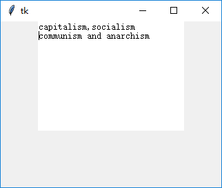
    

4. `bg`和`fg`属性

    有时需要设置前景色`fg`和背景色`bg`
    
        tk.Text(root, width=30, height=12, bg="black", fg="#16c60c", font=tk.font.Font(size=15)).pack()
    
    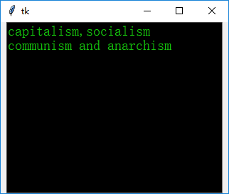

5. 索引方式

    `tk.Text`的索引方式和`tk.Entry`类似
    
    值得注意的是，line(行索引)从1开始，而column(列索引)和`tk.Entry`相同，从0开始。
    指定越界索引不会报错，而是会“粘黏”到最近的位置。共有如下索引类型(`{}`内表示需要用户自己填充)：
    
        基本类型                    (如"{line}.{column}", "{line}.end")
        用户定义/预定义的mark       (如tk.INSERT, tk.CURRENT, tk.END等)
        用户定义/预定义的tag        (如tk.SEL_FIRST, tk.SEL_LAST等)
        窗口坐标                    (如"@{x},{y}")
        嵌入对象(窗口，对象)的名称/引用
        表达式                     (如"{line}.{column} + {count} chars")
        
    "{line}.{column}"是最基本的索引方式。
    由于无法直接地指定一行中末尾字符的下一个字符的位置(虽然有越界自动粘黏机制)，因此引入了"{line}.end"，此处不再赘述。
    下例索引位置为"1.2"，即第 0 行第 2 列。
    
        text = tk.Text(root, width=30, height=12)
        text.pack()
        text.insert("1.0", "capitalism,socialism\ncommunism and anarchism")
        # 按钮回调函数
        def btn_callback(*args):
            text.insert("1.2", "*")
        tk.Button(root, text="insert at \"1.2\" (row 0, column 2)", command=btn_callback).pack()
        
    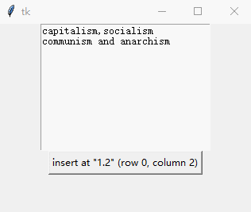
    
    `mark`通常在文中不可见，处于字符间，也可以用来索引。具体类型有：
        
    * `tk.INSERT`, `tk.CURRENT`, `tk.END`, `tk.SEL_FIRST`, `tk.SEL_LAST`等预定义`mark`
        
    * 用户自定义`mark`(使用`mark_set()`方法定义)
    
    `tk.INSERT`对应光标，`tk.CURRENT`对应最接近当前鼠标坐标的字符，而`tk.END`对应`tk.Text`末尾字符后方位置。
    "SEL"表示"selection"，即用户选中字符范围，所以`tk.SEL_FIRST`就是用户选定字符范围的第一个字符对应的位置，
    而`tk.SEL_LAST`对应用户选定字符范围最后一个字符对应位置的下一个位置。下例使用`tk.INSERT`进行示例：
    
        text = tk.Text(root, width=30, height=12)
        text.pack()
        text.insert("1.0", "capitalism,socialism\ncommunism and anarchism")
        # 按钮回调函数
        def btn_callback(*args):
            text.insert(tk.INSERT, "*")
        tk.Button(root, text="insert at tk.INSERT", command=btn_callback).pack()
    
    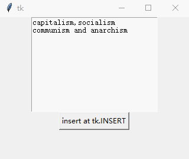
    
    下例使用`mark_set()`方法自定义了一个名为`my_mark`的`mark`，并用其索引：
    
        text = tk.Text(root, width=30, height=12)
        text.pack()
        text.insert("1.0", "capitalism,socialism\ncommunism and anarchism")
        # 用户自定义mark
        text.mark_set("my_mark", "1.2")
        # 按钮回调函数
        def btn_callback(*args):
            text.insert("my_mark", "*")
        tk.Button(root, text="insert at \"my_mark\"", command=btn_callback).pack()
        
    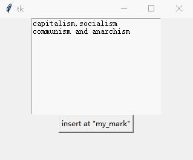
    
    `tag`表示字符范围，和`mark`表示单一字符位置不同。
    `tag`并不能直接用于索引，但是`{tag}.first`和`{tag}.last`是可以用于索引的。
    
    与`tk.Canvas`控件不同，`tag`和`tk.Text`控件并不是紧密绑定的，
    即`tag`的对应关系不会随着其对应文字的消失而消失。具体类型有：
    
    * tk.SEL
    
    * 用户自定义`tag`(通过`tag_add()`方法定义)
    
    虽然`tag`不能直接用于索引一个特定字符位置，但是通过`tag`可以实现指定范围字符的样式设置(通过`tag_configure()`方法)。
    下例对`tk.SEL`这个预定义`tag`所对应字符范围的文字样式进行了设置：
    
        text = tk.Text(root, width=30, height=12)
        text.pack()
        text.insert("1.0", "capitalism,socialism\ncommunism and anarchism")
        # 按钮回调函数
        def btn_callback(*args):
            text.tag_configure(tk.SEL, background="#000000", foreground="#16c60c", font=font.Font(size=20))
        tk.Button(root, text="change tk.SEL's style", command=btn_callback).pack()
        
    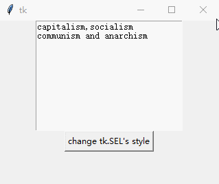
    
    下例使用`tk.SEL_LAST`进行索引：
    
        text = tk.Text(root, width=30, height=12)
        text.pack()
        text.insert("1.0", "capitalism,socialism\ncommunism and anarchism")
        # 按钮回调函数
        def btn_callback(*args):
            text.insert(tk.SEL_LAST, "*")
        tk.Button(root, text="insert at \"tk.SEL_LAST\"", command=btn_callback).pack()
    
    
    
    直接指定`@x,y`(窗口坐标(以像素记))，可以索引到距指定坐标最近的字符：
    
        text = tk.Text(root, width=30, height=12)
        text.pack()
        text.insert("1.0", "capitalism,socialism\ncommunism and anarchism")
        # 按钮回调函数
        def btn_callback(*args):
            text.insert("@100,20", "*")
        tk.Button(root, text="insert at (x=100, y=20)", command=btn_callback).pack()

    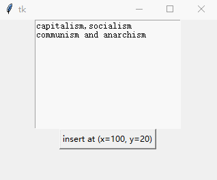
    
    也可以直接使用嵌入窗口/图片对象的引用作为索引：
    
        text = tk.Text(root, width=30, height=12)
        text.pack()
        text.insert("1.0", "capitalism,socialism\ncommunism and anarchism")
        _btn = tk.Button(root, text="_btn")
        text.window_create("2.5", window=_btn)
        # 按钮回调函数
        def btn_callback(*args):
            text.insert(_btn, "*")
        tk.Button(root, text="insert at _btn", command=btn_callback).pack()
        
    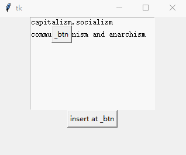
    
    使用表达式可以对任意索引进行修改。表达式的格式由两部分组成，
    第一部分是要修改索引的字符串表示(如果不是字符串，那么就使用str()函数得到的字符串)。
    
    第二部分是进行修饰的字符串，将其串联起来即可进行灵活的索引。具体地说，
        
    * `+ {count} chars`表示向前移动`count`个字符，如果本行不够会向上跨行，但是不会超过索引"1.0"。
    
    * `- {count} chars`表示向后移动`count`个字符，如果本行不够会向下跨行，但是不会超过索引`tk.END`。
    
    * `+ {count} lines`表示向上移动`count`行，尽可能贴近原索引列，但是不会超过索引"1.0"。
    
    * `- {count} lines`表示向下移动`count`行，尽可能贴近原索引列，但是不会超过索引`tk.END`。
    
    * `linestart`/`lineend`表示本行行首/行尾
    
    * `wordstart`/`wordend`表示当前单词词首/词尾。
    
    * `chars` 可以简写成`c`，`lines`可以简写为`l`。
    
    最常用的比如`1.0 + 5 chars`，表示第0行第5列(虽然tkinter从第1行开始，但是本文中从第0行开始数行)。
    下例索引的位置为嵌入按钮后5个字符。
    
        text = tk.Text(root, width=30, height=12)
        text.pack()
        text.insert("1.0", "capitalism,socialism\ncommunism and anarchism")
        _btn = tk.Button(root, text="_btn")
        text.window_create("2.5", window=_btn)
        # 按钮回调函数
        def btn_callback(*args):
            text.insert(str(_btn) + "+5c", "*")
        tk.Button(root, text="insert at str(_btn) \" + 5chars\"", command=btn_callback).pack()
        
    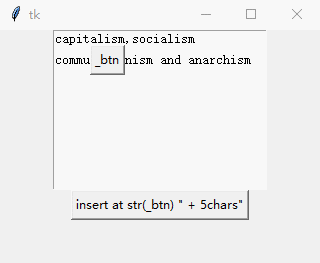
    
    最后，使用`index()`方法可以将任何格式的索引转换成`{line}.{column}`格式：
    
        text = tk.Text(root, width=30, height=12)
        text.pack()
        text.insert("1.0", "capitalism,socialism\ncommunism and anarchism")
        # 按钮回调函数
        def btn_callback(*args):
            btn.configure(text="index: " + text.index(tk.SEL_FIRST))
        btn = tk.Button(root, text="show index str of \"tk.END\"", command=btn_callback)
        btn.pack()
        
    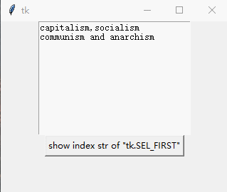
    
6. 使用`insert()`方法插入字符

    此方法参数为`insert(self, index, chars, *args)`。那么重新使用插入`tk.END`的例子进行演示：
    
        text = tk.Text(root, width=30, height=12)
        text.pack()
        text.insert("1.0", "capitalism,socialism\ncommunism and anarchism")
        # 按钮回调函数
        def btn_callback(*args):
            text.insert(tk.END, "*")
        tk.Button(root, text="insert at tk.END", command=btn_callback).pack()
    
    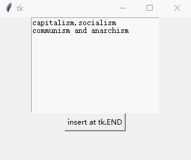
    
7. 使用`delete()`方法删除字符

    此方法参数为`delete(self, index1, index2=None)`，会删除从`index1`(包括)到`index2`(不包括)之间的所有字符。
    如果只传入`index1`那么只会删除索引后方的单个字符。下例删除了`tk.Text`中的所有字符：
    
        text = tk.Text(root, width=30, height=12)
        text.pack()
        text.insert("1.0", "capitalism,socialism\ncommunism and anarchism")
        # 按钮回调函数
        def btn_callback(*args):
            text.delete("1.0", tk.END)
        tk.Button(root, text="delete all", command=btn_callback).pack()
        
    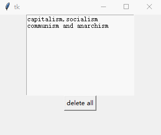
    
    

    
    
    