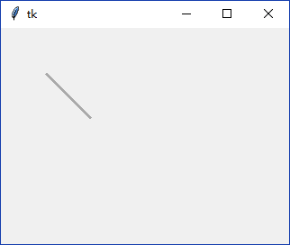
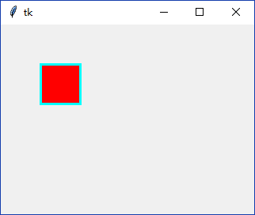
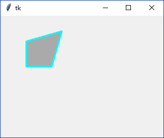
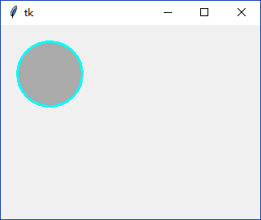
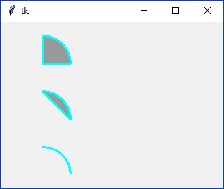
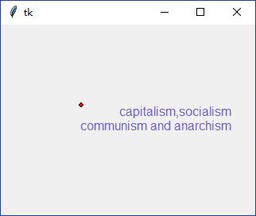
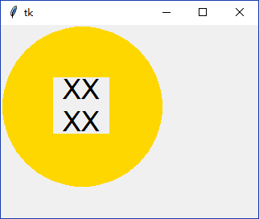
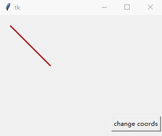
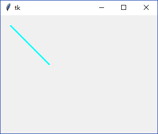
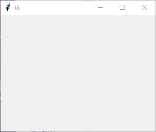

### Canvas

Canvas可用于创建各种自定义控件

------------------

1. 声明一个`tk.Canvas`

    `tk.Canvas`默认没有任何样式

        canvas = tk.Canvas(root, width=320, height=240)
        canvas.pack()
        
    
    

2. 使用`create_xxx()`方法在`tk.Canvas`对象上描绘图形

    1. 使用`create_line()`绘制直线或折线
        
        查看源码可得方法声明：
        
            def create_line(self, *args, **kw):
                """Create line with coordinates x1,y1,...,xn,yn."""
                return self._create('line', args, kw) 
                
        那么只要指定相应的`x1`，`y1`，`x2`，`y2`即可描出一条直线(多指定即是折线)。
        可以使用`fill`参数（而不是`color`）指定绘制颜色，`width`指定绘制宽度：
        
            canvas = tk.Canvas(root, width=320, height=240)
            canvas.pack()
            canvas.create_line(50, 50, 100, 100, fill="#aaaaaa", width=3)
        
        
    
    2. 使用`create_rectangle()`方法绘制矩形
    
        查看源码可得方法声明：
        
            def create_rectangle(self, *args, **kw):
                """Create rectangle with coordinates x1,y1,x2,y2."""
                return self._create('rectangle', args, kw)
    
        那么只要指定相应的矩形左上角`x1`，`y1`坐标和右下角`x2`，`y2`坐标即可。
        可以使用`outline`参数指定边框颜色，`width`参数指定边框宽度，
        而`fill`参数指定填充颜色(默认透明)
        
            canvas = tk.Canvas(root, width=320, height=240)
            canvas.pack()
            canvas.create_rectangle(50, 50, 100, 100, outline="cyan", fill="#aaaaaa", width=3)
        
        
    
    3. 使用`create_polygon()`方法绘制多边形
    
        查看源码可得方法声明：
       
            def create_polygon(self, *args, **kw):
                """Create polygon with coordinates x1,y1,...,xn,yn."""
                return self._create('polygon', args, kw) 
        
        那么指定四个点就可以绘制四边形了。
        可以使用`outline`参数指定边框颜色，`width`参数指定边框宽度，
        而`fill`参数指定填充颜色(默认黑色)
        
            canvas = tk.Canvas(root, width=320, height=240)
            canvas.pack()
            canvas.create_polygon(50, 50, 50, 100, 100, 100, 120, 30, outline="cyan", width=3, fill="#aaaaaa")
        
        
        
    4. 使用`create_oval()`方法绘制椭圆
    
        查看源码可得方法声明：
        
            def create_oval(self, *args, **kw):
                """Create oval with coordinates x1,y1,x2,y2."""
                return self._create('oval', args, kw)
    
        那么只要指定相应包围椭圆的矩形(bounding-box)左上角`x1`，`y1`坐标和右下角`x2`，`y2`坐标即可。
        可以使用`outline`参数指定边框颜色，`width`参数指定边框宽度，
        而`fill`参数指定填充颜色(默认透明)
        
            canvas = tk.Canvas(root, width=320, height=240)
            canvas.pack()
            canvas.create_oval(20, 20, 100, 100, outline="cyan", width=3, fill="#aaaaaa")
   
        
        
    5. 使用`create_arc()`方法绘制扇形、弦或弧
    
        查看源码可得方法声明：
        
            def create_arc(self, *args, **kw):
                """Create arc shaped region with coordinates x1,y1,x2,y2."""
                return self._create('arc', args, kw)

        和绘制椭圆类似，此方法也指定包围矩形(bounding-box)的左上和右下角坐标。
        不同的是有额外的参数`start`控制起始角度，`extent`控制弧形扫过的角度，
        `style`控制绘制形状：
        
        * `tk.PIESLICE`为扇形(默认)
        * `tk.CHORD`为弦
        * `tk.ARC`为弧
        
        可以使用`outline`参数指定边框颜色，`width`参数指定边框宽度，
        而`fill`参数指定填充颜色(默认透明)
        
            canvas = tk.Canvas(root, width=320, height=240)
            canvas.pack()
            canvas.create_arc(20, 20, 100, 100, start=0, extent=90, style=tk.PIESLICE, outline="cyan", width=3, fill="#999999")
            canvas.create_arc(20, 100, 100, 180, start=0, extent=90, style=tk.CHORD, outline="cyan", width=3, fill="#999999")
            canvas.create_arc(20, 180, 100, 260, start=0, extent=90, style=tk.ARC, outline="cyan", width=3, fill="#999999")
        
        
        
    6. 使用`create_text()`方法绘制文字
    
        查看源码可得方法声明：
        
            def create_text(self, *args, **kw):
                """Create text with coordinates x1,y1."""
                return self._create('text', args, kw)
                
        既然是绘制文字，那么对于文字的属性在此也可以当成参数。
            
        * `font`参数：指定绘制字体，例如`("Arial", 12, "normal")`
        * `justify`参数：指定行对齐方式，默认为`tk.LEFT`
        * `width`参数：指定行最大长度(按像素计)，默认为`0`(不换行)
        * `anchor`参数：指定指定坐标(点(`x1`,`y1`))对应绘制文字的哪个位置，
        默认为`tk.CENTER`，即指定坐标和绘制文字中心对齐
        
        此外一些`create_xxx()`通用参数也有效：
        
        * `fill`参数：指定绘制文字的颜色
        
        为了显示出`anchor`的效果，在指定坐标(`x1`,`y1`)处画了一个小圆圈。
        
            canvas = tk.Canvas(root, width=320, height=240)
            canvas.pack()
            canvas.create_oval(98, 98, 103, 103, fill="red")
            canvas.create_text(100, 100, text="capitalism,socialism\ncommunism and anarchism", fill="#6c5fcd",
                               font=("Arial", 12, "normal"), justify=tk.RIGHT, width=0, anchor=tk.NW)
        
        
        
    7. 使用`create_window()`方法绘制任意控件
    
        查看源码可得方法声明：
        
            def create_window(self, *args, **kw):
                """Create window with coordinates x1,y1,x2,y2."""
                return self._create('window', args, kw)  
      
        常用参数有：
        
        * `window`参数：指定控件对象
        * `height`参数：指定绘制控件的高度。默认为控件原本的高度
        * `width`参数：指定绘制控件的宽度。默认为控件原本的宽度
        * `anchor`参数：指定绘制坐标和控件哪个部位对齐
          
        不能在控件上方绘制出任何其他图案(即使用此方法绘制的控件处于最顶层)。
        本例在`tk.Button`控件绘制后，绘制了一个圆，这个圆并不会覆盖按钮区域(如果是其它绘制图案，那么默认情况下会被覆盖掉)
        
            canvas = tk.Canvas(root, width=320, height=240)
            canvas.pack()
            # 用于create_window()的按钮
            _btn = tk.Button(canvas, text="XXXX", font=("Arial", 26), wraplength=50, relief=tk.FLAT) 
            canvas.create_window(100, 100, window=_btn, width=70, height=70, anchor=tk.CENTER)
            canvas.create_oval(2, 2, 200, 200, fill="gold", width=0) # 绘制图案(圆)
            
        
        
    8. 使用`create_image`方法绘制图片
        
        查看源码可得方法声明：
        
            def create_image(self, *args, **kw):
                """Create image item with coordinates x1,y1."""
                return self._create('image', args, kw)
        
        常用参数有：
        
        * `image`参数：要显示的图像
        * `anchor`参数：指定图片和点的对应方式
        
        本例中图片的中间和点`(0, 0)`对齐
        
            canvas = tk.Canvas(root, width=320, height=240)
            canvas.pack()
            from PIL.ImageTk import PhotoImage
            from PIL import Image
            img = PhotoImage(Image.open("d:\\77654ffb2eabc662ee1dc5651ec31991.jpg"))
            canvas.create_image(0, 0, image=img, anchor=tk.CENTER)    
     
        
        
    9.  `create_xxx()`的透明色问题
    
        将颜色设置为空字符串即为透明

3. 使用`coords()`方法获取/改变坐标

    `create_xxx()`方法会返回代表创建项的id，根据这个id可以获取/改变已创建项的坐标
    
    * 如果只传入创建项的id，那么`coords()`方法会返回此id对应项的坐标
    * 如果传入创建项id和新坐标，那么`coords()`方法会将此id对应项的坐标设置为新坐标
    
    下例使用了上述传参方式。
    
        canvas = tk.Canvas(root, width=320, height=240)
        canvas.pack()
        line_id = canvas.create_line(20, 20, 100, 100, fill="brown", width=3)
        print(canvas.coords(line_id))  # 获取坐标
        _btn = tk.Button(canvas, text="change coords", command=lambda: canvas.coords(line_id, 100, 100, 200, 200))  # 按钮
        canvas.create_window(220, 200, anchor=tk.NW, window=_btn)
    
    
    
4. 使用`itemconfigure()`方法设置项属性

    与普通控件可用`configure()`方法设置属性相似，
    使用`create_xxx()`方法创建出的项可用`itemconfigure()`方法设置属性。
    
    如果不使用关键字方式传入设置属性，那么这个方法会返回当前id对应项的所有可用属性。
    
        canvas = tk.Canvas(root, width=320, height=240)
        canvas.pack()
        line_id = canvas.create_line(20, 20, 100, 100, fill="brown", width=3)
        print(canvas.itemconfigure(line_id))  # 查看所有可用属性
        canvas.itemconfigure(line_id, fill="cyan")
        
    
    
5. 使用`delete()`方法移除项

    传入相应id即可移除对应项
    
        canvas = tk.Canvas(root, width=320, height=240)
        canvas.pack()
        line_id = canvas.create_line(20, 20, 100, 100, fill="brown", width=3)
        canvas.delete(line_id)

    
    
6. 选定项的方式

    在使用上述方法(例如`delete()`方法)时传入了id，但还有指定项的其它方式。
    
    * id
    * `tk.ALL`
    * `tk.CURRENT`
    * tags
    
    `tk.ALL`即指定当前所有项，`tk.CURRENT`
    