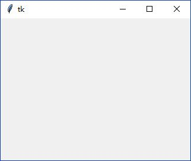

### Canvas

Canvas可用于创建各种自定义控件

------------------

1. 声明一个`tk.Canvas`(默认没有任何样式)

        canvas = tk.Canvas(root, width=320, height=240)
        canvas.pack()
        
    
    

2. 使用`create_xxx()`方法在`tk.Canvas`对象上描绘图形

    1. `create_line()`
        
        使用`create_line()`绘制直线或折线。我们可以看到其声明：
        
            def create_line(self, *args, **kw):
                """Create line with coordinates x1,y1,...,xn,yn."""
                return self._create('line', args, kw) 
                
        那么只要指定相应的`x1`，`y1`，`x2`，`y2`，即可描出一条直线：
    
    2. 
    
    3.
    4.
    5.

    