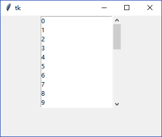
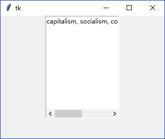
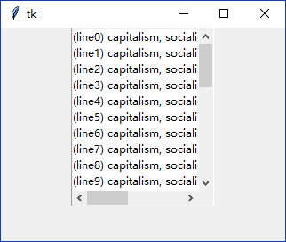
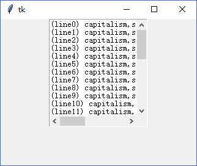
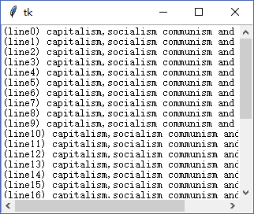

### Scrollbar 

通常滚动条和`tk.Listbox`，`tk.Text`或`tk.Canvas`共同使用。

--------------------------------------

1. 和`tk.Listbox`共同使用
    
    1. 竖直滚动条

        绑定控件`yscrollcommand`为滚动条的`set()`方法，这样控件滚动时，滚动条也会随之变化
        
        绑定滚动条的`command`为控件的`yview()`方法，这样滚动条变化时，控件也会随之变化。
        
        下例使用了`tk.Listbox`作为示范。为了让滚动条足够美观(默认滚动条很短)，使用了`pack`布局。
        
            frame = tk.Frame()
            frame.pack()
            # 声明滚动条
            sb = tk.Scrollbar(frame)
            sb.pack(side=tk.RIGHT, fill=tk.Y)
            # 声明Listbox
            lb = tk.Listbox(frame)
            lb.pack(fill=tk.BOTH)
            [lb.insert(tk.END, _) for _ in range(30)]
            # 绑定事件
            sb.configure(command=lb.yview)
            lb.configure(yscrollcommand=sb.set)
        
        
        
    2. 水平滚动条
    
        滚动条默认是竖直方向(`tk.VERTICAL`)的，需要设置`orient`为`tk.HORIZONTAL`。
        还需要将`yscrollcommand`改为`xscrollcommand`，`yview`改为`xview`。
        
        此外还需要调整`pack`布局参数使得滚动条合乎常理。滚动条默认没有边框，而`tk.Listbox`默认有边框。
        所以显示外围`tk.Frame`的边框，并隐藏`tk.Listbox`的边框将会更加美观：
        
            frame = tk.Frame(relief=tk.SUNKEN, border=1)
            frame.pack()
            # 声明滚动条
            sb = tk.Scrollbar(frame, orient=tk.HORIZONTAL)
            sb.pack(side=tk.BOTTOM, fill=tk.X)
            # 声明Listbox
            lb = tk.Listbox(frame, border=0)
            lb.pack(fill=tk.BOTH)
            lb.insert(tk.END, "capitalism, socialism, communism and anarchism")
            # 绑定事件
            sb.configure(command=lb.xview)
            lb.configure(xscrollcommand=sb.set)
            
        
        
    3. 水平和竖直滚动条
        
        当同时使用两个方向的滚动条的时候，使用`pack`布局比较复杂(或者效果不理想),
        因此本例使用了`grid`布局。
        
            frame = tk.Frame(relief=tk.SUNKEN, border=1)
            frame.pack()
            # 声明滚动条
            vsb = tk.Scrollbar(frame)
            vsb.grid(row=0, column=1, sticky=tk.NS)
            hsb = tk.Scrollbar(frame, orient=tk.HORIZONTAL)
            hsb.grid(row=1, column=0, sticky=tk.EW)
            # 声明Listbox
            lb = tk.Listbox(frame, border=0)
            lb.grid(row=0, column=0, sticky=tk.NSEW)
            for i in range(30):
                lb.insert(tk.END, "(line{}) capitalism, socialism, communism and anarchism".format(i))
            # 绑定事件
            hsb.configure(command=lb.xview)
            lb.configure(xscrollcommand=hsb.set)
            vsb.configure(command=lb.yview)
            lb.configure(yscrollcommand=vsb.set)
        
        
        
2. 和`tk.Text`共同使用

    1. 设置`wrap`属性
        
        在介绍`tk.Text`时，特意遗漏掉一个属性`wrap`。这个属性控制了如何换行，这很重要，这个选项决定了水平滚动条能否使用。
        
        * `tk.CHAR`(默认)
        * `tk.WORD`
        * `tk.NONE`
        
        在默认是`wrap`为`tk.CHAR`的情况下，那么只要英文到达了边缘就会换行。
        如果是显示英文，那么将`wrap`属性设置为`tk.WORD`可能更加美观。
        
        如果`wrap`属性设置为`tk.NONE`，那么超过边缘的文字不会换行，这时就可以使用水平滚动条显示超出边缘的文字了
        
            frame = tk.Frame(relief=tk.SUNKEN, border=1)
            frame.pack()
            # 声明滚动条
            hsb = tk.Scrollbar(frame, orient=tk.HORIZONTAL)
            hsb.grid(row=1, column=0, sticky=tk.EW)
            vsb = tk.Scrollbar(frame)
            vsb.grid(row=0, column=1, sticky=tk.NS)
            # 声明textarea
            textarea = tk.Text(frame, wrap=tk.NONE, height=12, width=20, border=0)
            textarea.grid(row=0, column=0, sticky=tk.NSEW)
            textarea.insert("1.0", "".join(["(line{}) capitalism,socialism communism and anarchism\n".format(i) for i in range(30)]))
            # 绑定事件
            vsb.configure(command=textarea.yview)
            textarea.configure(yscrollcommand=vsb.set)
            hsb.configure(command=textarea.xview)
            textarea.configure(xscrollcommand=hsb.set)
            
        
        
    2. 自适应父控件大小
        
        `grid_rowconfigure()`和`grid_columnconfigure()`方法有3个可选参数。
        查看源码可得
        
            def grid_rowconfigure(self, index, cnf={}, **kw):
                """Configure row INDEX of a grid.
                Valid resources are minsize (minimum size of the row),
                weight (how much does additional space propagate to this row)
                and pad (how much space to let additionally)."""
        
        我们在父控件(下例中为`frame`)上设置`grid_rowconfigure(0, weight=1)`，
        这意味改变了空间大小改变时，第0行子控件的行为。
        这样就不用像从前使用`width`，`height`等属性控制子控件的大小了。
        
            frame = tk.Frame(relief=tk.SUNKEN, border=1)
            frame.pack()
            # 适应缩放
            frame.grid_rowconfigure(0, weight=1)
            frame.grid_columnconfigure(0, weight=1)
            # 声明滚动条
            hsb = tk.Scrollbar(frame, orient=tk.HORIZONTAL)
            hsb.grid(row=1, column=0, sticky=tk.EW)
            vsb = tk.Scrollbar(frame)
            vsb.grid(row=0, column=1, sticky=tk.NS)
            # 声明textarea
            textarea = tk.Text(frame, wrap=tk.NONE, border=0)
            textarea.grid(row=0, column=0, sticky=tk.NSEW)
            textarea.insert("1.0", "".join(["(line{}) capitalism,socialism communism and anarchism\n".format(i) for i in range(30)]))
            # 绑定事件
            vsb.configure(command=textarea.yview)
            textarea.configure(yscrollcommand=vsb.set)
            hsb.configure(command=textarea.xview)
            textarea.configure(xscrollcommand=hsb.set)
            
        