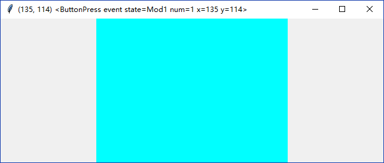
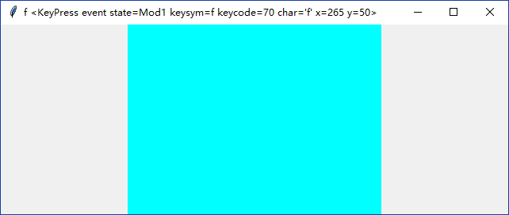

### Event

`tkinter`维护着一个`eventloop`。当用户触发了某事件(亦或其它情景)，此时一个`tk.Event`对象就产生了。

-----------------------------

1. 使用`bind()`方法绑定事件

    1. 使用`bind()`方法捕捉鼠标事件
        
        本例在`tk.Frame`上绑定了`<Button-1>`(即鼠标左键点击)事件到函数`callback()`上。
        
        `<Button-2>`和`<Button-3>`分别对应了鼠标滚轮(如果有)点击和鼠标右键点击，而`<Motion>`对应鼠标移动。
    
            frame = tk.Frame(root, width=320, height=240, bg="cyan")
            frame.pack()
            def callback(event):
                root.title("({}, {}) {}".format(event.x, event.y, event))
            frame.bind("<Button-1>", callback)
        
        
            
    2. 使用`bind()`方法捕捉键盘事件
    
        和捕捉鼠标事件不同的是，键盘事件会传给当前处于`focus`状态的控件，默认是`root`。
        本例中则需要使用`focus_set()`方法将键盘事件导向`frame`。
        
        `<Key>`默认捕捉所有键盘按键，如果需要捕捉特定按键可以更具体一些，比如`<Key-w>`(小写w)，`<Key-Up>`(上方向键)。
        
            frame = tk.Frame(root, width=320, height=240, bg="cyan")
            frame.pack()
            def callback(event):
                root.title("{} {}".format(event.char, event))
            frame.bind("<Key>", callback)
            frame.focus_set()
    
        
        
2. `tk.Event`

    `tk.Event`是一个事件的container。在三种情况下会被创建：
    
    * 鼠标事件`ButtonPress`，`ButtonRelease`，`Motion`，`Enter`，`Leave`，`MouseWheel`
    * 键盘事件`KeyPress`，`KeyRelease`
    * 窗口事件`Visibility`， `Unmap`，`Map`，`Expose`，`FocusIn`，`FocusOut`，`Circulate`，`Colormap`，`Gravity`，
    `Reparent`，`Property`，`Destory`，`Activate`，`Deactivate`
    
    如果用户通过`bind()`，`bind_all()`，`bind_class()`或者`tag_bind()`方法绑定了一个回调函数，
    那么当事件发生时这个回调函数会被调用，且第一个参数是一个`tk.Event`对象。这个对象里有如下常用属性：
    
    * `x`，`y`：当前鼠标坐标
    * `x_root`，`y_root`：当前鼠标绝对坐标
    * `char`：char(仅限键盘事件)
    * `widget`：生成事件的控件
    * `width`, `height`：控件新的高度和宽度(仅限Configure事件)
    
    `tk.Event`源码中有详细介绍，此处不再赘述。

3. 自定义`bind()`方法中`sequence`参数

    在`tkinter`的设计中，用户使用一个特殊格式的字符串来描述事件的种类(比如`"<Button-1>"`表示鼠标左键点击)。
    既然了解了`tk.Event`，那么现在可以开始介绍如何构建`sequence`字符串了。

    可以使用`bind()`方法绑定自定义事件，方法定义如下。
        
        def bind(self, sequence=None, func=None, add=None):
            """Bind to this widget at event SEQUENCE a call to function FUNC.
    
            SEQUENCE is a string of concatenated event
            patterns. An event pattern is of the form
            <MODIFIER-MODIFIER-TYPE-DETAIL> where MODIFIER is one
            of Control, Mod2, M2, Shift, Mod3, M3, Lock, Mod4, M4,
            Button1, B1, Mod5, M5 Button2, B2, Meta, M, Button3,
            B3, Alt, Button4, B4, Double, Button5, B5 Triple,
            Mod1, M1. TYPE is one of Activate, Enter, Map,
            ButtonPress, Button, Expose, Motion, ButtonRelease
            FocusIn, MouseWheel, Circulate, FocusOut, Property,
            Colormap, Gravity Reparent, Configure, KeyPress, Key,
            Unmap, Deactivate, KeyRelease Visibility, Destroy,
            Leave and DETAIL is the button number for ButtonPress,
            ButtonRelease and DETAIL is the Keysym for KeyPress and
            KeyRelease. Examples are
            <Control-Button-1> for pressing Control and mouse button 1 or
            <Alt-A> for pressing A and the Alt key (KeyPress can be omitted).
            An event pattern can also be a virtual event of the form
            <<AString>> where AString can be arbitrary. This
            event can be generated by event_generate.
            If events are concatenated they must appear shortly
            after each other.
    
            FUNC will be called if the event sequence occurs with an
            instance of Event as argument. If the return value of FUNC is
            "break" no further bound function is invoked.
    
            An additional boolean parameter ADD specifies whether FUNC will
            be called additionally to the other bound function or whether
            it will replace the previous function.
    
            Bind will return an identifier to allow deletion of the bound function with
            unbind without memory leak.
    
            If FUNC or SEQUENCE is omitted the bound function or list
            of bound events are returned."""
    
            return self._bind(('bind', self._w), sequence, func, add)

   

