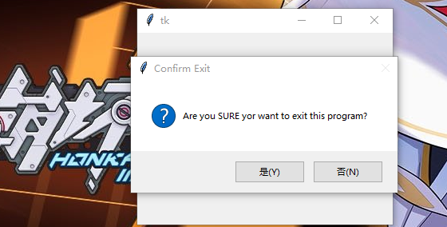

### protocol

除了事件机制以外，`tkinter`还支持句柄机制。这个协议这个协议适用于应用和窗口管理器之间的内部交互。

-----------------------------

1. 注册`WM_DELETE_WINDOW`句柄自定义关闭窗口动作

        def callback():
            if tk.messagebox.askyesno("Confirm Exit", "Are you SURE yor want to exit this program?"):
                root.destroy()
        root.protocol("WM_DELETE_WINDOW", callback)
        
   