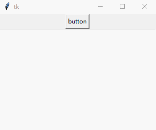
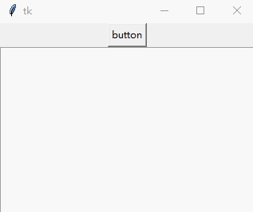

### 非阻塞按钮

如果在用户按下按钮执行一个耗时的工作，那么整个窗口就会无响应，直至回调函数返回。

---------------------
1. 使用并发解决
    
    比如说，我们需要做一件耗时3s的工作,那么用户直接按下按钮后，界面就会卡顿5s，用户体验不好。
    
        def callback():
            time.sleep(3)  # do something network I/O or database connection
            result = "The time-consuming process result"
            text.delete("1.0", tk.END)  # show the result
            text.insert("1.0", result)
        tk.Button(root, text="button", command=callback).pack()
        text = tk.Text(root)
        text.pack()

    
    
    可使用`threading`库实现并发从而解决界面卡顿
    
        def callback():
            def _():
                time.sleep(3)  # do something network I/O or database connection
                result = "The time-consuming process result"
                text.delete("1.0", tk.END)  # show the result
                text.insert("1.0", result)
            threading.Thread(target=_).start()
        tk.Button(root, text="button", command=callback).pack()
        text = tk.Text(root)
        text.pack()

    
