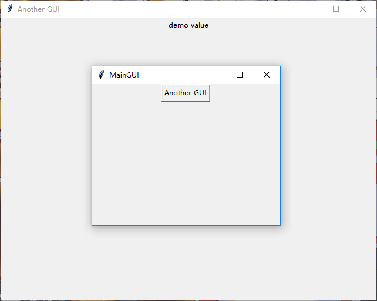

### 使用`tk.Toplevel`实现多窗口界面

------------------------------
1. 使用类封装每个窗口所用的数据结构和算法

        import tkinter as tk
        
        class MainGUI(object):
            def __init__(self):
                self.root = tk.Tk()
                self.root.geometry("320x240")
                self.root.title("MainGUI")
                tk.Button(self.root, text="Another GUI", command=self._btn_callback).pack()
                tk.mainloop()
            def _btn_callback(self):
                AnotherGUI("demo value")  # 初始化另一个窗口
        
        class AnotherGUI(object):
            def __init__(self, demo_value: str):
                self.root = tk.Toplevel()
                self.root.geometry("640x480")  # 设置新窗口大小
                self.root.title("Another GUI")  # 设置新窗口标题
                self.root.focus_set()  # 让新窗口接受键盘输入，便于事件绑定
                tk.Label(self.root, text=demo_value).pack()
        
        if __name__ == '__main__':
            MainGUI()

    
